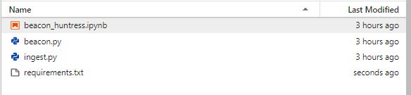

#
## __Table of Contents__

> * [Home](../../../readme.md)
> * [Jupyter Notebook](#jupyter)
>   * [Setup](#setup)
>   * [Run Jupyter Notebook](#jupyter_run)

## <a name="jupyter"></a>__Jupyter Notebook__

Complete the steps below to setup Beacon Huntress on Jupyter.

> ### __Note__<br>
> Beacon Huntress has python dependancies that are required for operation.  __Do not skip steps 5 & 6 from the setup!__

### <a name="setup"></a>__Juptyer Notebook Setup__
1) Create a folder in Jupyter called `beacon_huntress`.<br>
2) Copy the `/src/lib/jupyter/beacon_huntress.ipynb` file from this repository into the beacon_huntress folder in Jupyter.<br>
3) Copy the `/src/bin/beacon/beacon.py` folder from this repository into Jupyter.<br>
4) Copy the `/src/bin/ingest.py` folder from this repository into Jupyter.<br>
5) Copy the `/src/lib/jupyter/requirements.txt` file into the beacon_huntress folder in Jupyter.<br>
6) Open a Jupyter terminal session and execute the code below to install the requirements.txt into a Jupyter kernel called beacon_huntress.<br>

```shell
# CREATE VIRTUAL ENV
python3 -m venv beacon_huntress

# ACTIVATE VIRTUAL ENV
source $HOME/beacon_huntress/bin/activate

# INSTALL REQUIREMENTS FILE
pip3 install -r beacon_huntress/requirements.txt

# LOAD KERNEL TO JUPYTER
sudo ipython kernel install --name "beacon_huntress"
```

After everything is installed you should see this structure:



### <a name="jupyter_run"></a>__Run Jupyter Notebook__

Open beacon_huntress.ipynb inside a Jupyter notebook. Run the steps below.

1) Run the `BUILD BRONZE DATA LAYER` shell.
    * __src_loc__ <i>(string) </i><br>
    Raw Bro/Zeek logs folder.
    * __bronze_loc__ <i>(string)</i><br>
    Bronze folder location.  Folder where data will compressed and converted to parquet format.

    ```python
    import ingest

    # BUILD BRONZE DATA LAYER
    ingest.build_bronze_layer(
        src_loc="data/raw/data", 
        bronze_loc="data/bronze/zeek/raw/parquet/mc3"
        )
    ```    

2) Run the `CREATE FILTERED FILES` shell to filter files. 
    * __src_loc__ <i>(string)</i><br>
    Raw Bro/Zeek logs folder.
    * __dest_exclude_file__ <i>(string)</i><br>
    Destination folder location for non-matching filters.  __Matches are excluded from the results.__.<br>
    Use a unique folder name at the end to identify your filter, a data folder will appended automatically.<br>
    Pass a blank double quote ("") to skip the creation of an exclude file.<br>
    * __port_filter__ <i>(list)</i><br>
    Ports you want to include, in list format.

    ```python
    # CREATE FILTERED FILES
    # SEE README.MD FOR ADDITIONAL OPTIONS
    ingest.build_filter_files(
    src_loc = "data/bronze/zeek/raw/parquet/mc3",
    dest_exclude_file = "data/bronze/zeek/filtered/parquet",
    port_filter = [80, 443]
    )
    ```    

3) Run the `BUILD DELTA FILES` shell to build the delta files. 
    * __src_file__ <i>(string)</i><br>
    Source folder or file location.<br>
    * __delta_file_loc__ <i>(string)</i><br>
    Destination folder or file location for delta files.<br>

    ```python
    # BUILD DELTA FILES
    ingest.build_delta_files(src_loc = "data/bronze/zeek/filtered/parquet",
                         delta_file_loc = "data/silver/delta")
    ```

4) Choose the algorithm you want to run and configure the settings. Some examples are included below, but see the [Beacon Algorithms](../algorithms) page for more details.

    * Agglomerative Clustering
         ```python
        import beacon

        # AGGLOMERATIVE CLUSTERING
        # SLOW BEACON
        beacon.agglomerative_clustering(
            delta_file = "data/silver/delta/delta_1655318432.parquet",
            delta_column = "delta_mins",
            max_variance = .12,
            min_records = 10,
            cluster_factor = .70,
            line_amounts = [1],
            min_delta_time = 1200000
        )
        ```
    
    * DBScan Clustering

        ```python
        import beacon

        # DBSCAN
        # SLOW BEACON
        beacon.dbscan_clustering(
            delta_file = "data/silver/delta/delta_1655318432.parquet",,
            delta_column = "delta_mins",
            spans = [[0, 5], [2, 15], [15, 35], [30, 60]],
            minimum_delta = 20,
            minimum_points_in_cluster = 10,
            minimum_likelihood = 0.70
        )
        ```

    * DBScan by Variance

        ```python
        import beacon

        # DBSCAN by VARIANCE
        # SLOW BEACON
        beacon.dbscan_by_variance(
            delta_file = "data/silver/delta/delta_1655318432.parquet",
            delta_column = "delta_mins",
            avg_delta = 20,
            conn_cnt = 10,
            span_avg = 15,
            variance_per = 15,
            minimum_likelihood = 70
        )
        ```

#
Valkyrie Framework<br>
Copyright 2023 Carnegie Mellon University.<br>
NO WARRANTY. THIS CARNEGIE MELLON UNIVERSITY AND SOFTWARE ENGINEERING INSTITUTE MATERIAL IS FURNISHED ON AN "AS-IS" BASIS. CARNEGIE MELLON UNIVERSITY MAKES NO WARRANTIES OF ANY KIND, EITHER EXPRESSED OR IMPLIED, AS TO ANY MATTER INCLUDING, BUT NOT LIMITED TO, WARRANTY OF FITNESS FOR PURPOSE OR MERCHANTABILITY, EXCLUSIVITY, OR RESULTS OBTAINED FROM USE OF THE MATERIAL. CARNEGIE MELLON UNIVERSITY DOES NOT MAKE ANY WARRANTY OF ANY KIND WITH RESPECT TO FREEDOM FROM PATENT, TRADEMARK, OR COPYRIGHT INFRINGEMENT.
Released under a MIT (SEI)-style license, please see license.txt or contact permission@sei.cmu.edu for full terms.
[DISTRIBUTION STATEMENT A] This material has been approved for public release and unlimited distribution.  Please see Copyright notice for non-US Government use and distribution.<br>
Carnegie Mellon® and CERT® are registered in the U.S. Patent and Trademark Office by Carnegie Mellon University.<br>
DM23-0210<br>