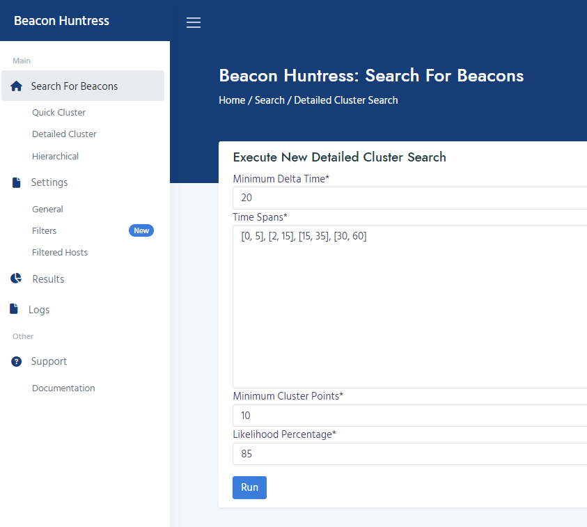
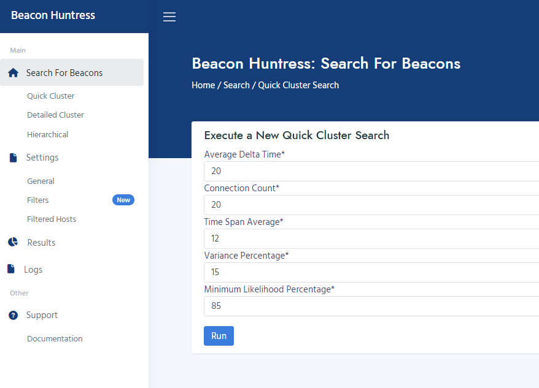

#
## __Table of Contents__

> * [Home](../../../readme.md)
> * [Overview](#overview)
> * [Beacons Algorithms](#searchforbeacons)
>   * [Cluster Search](#clustersearch)
>   * [Hierarchical Search](#hierarchicalsearch)
>   * [Quick Cluster Search](#quickcluster)

#
## <a name="overview"></a>__Overview__

Beacon Huntress can be configured to search for beacons using the algorithms below. Each Machine Learning (ML) algorithm has its own unique parameters and is used to search for slow or fast beacons based on time intervals.

#
## <a name="searchforbeacons"></a>__Advanced Search for Beacons__

Below are the current algorithms that can be used when searching for beacons.  

* [Cluster Search](#clustersearch)
    * Use with Fast or Slow Beacons
* [Hierarchical Search](#hierarchicalsearch)
    * Use with Fast Beacons
* [Quick Cluster Search](#quickcluster)
    * Use with Fast or Slow Beacons

> ### __Note__<br>
> 
>  Algorithms can be set by using the `cluster_type` option in [config.conf](configuration.md). The default algorithm is Quick Cluster Search with Slow Beacon parameters used for [dbscan_by_variance()](#dbscanbyvariance).<br>

#
## <a name="beaconssearch"></a>__Beacon Searches__


### <a name="clustersearch"></a>__Cluster Search__

Cluster Search is also known as DBScan, which stands for Density-Based Spatial Clustering of Applications with Noise.  DBScan can identify clusters of different sizes within large data samples that contain noise and outliers.  DBScan primarily uses two parameters: Minimum Points and EPS (Epsilion).  The Minimum Points parameter represents the minimum number of data points (the threshold) that must be clustered together for a region to be considered dense.  EPS is the maximum distance between two data points for them to be considered part of the same cluster.

* DBScan cluster is a good choice for searching either [Fast Beacons](../../../readme.md#a-idfsbeaconsafastslow-beacon) or [Slow Beacons](../../../readme.md#a-idfsbeaconsafastslow-beacon).  However, this is the slowest running algorithim.
 


<br>image source: https://www.kdnuggets.com/2020/04/dbscan-clustering-algorithm-machine-learning.html

### __Parameters__
* __Minimum Delta Time__ <i>(int)</i><br>
The minimum time interval in minutes for your search.<br>

* __Time Spans__ <i>(list)</i> <br>
Spans of time that you wish to search, in list format. <br>
<i>EXAMPLE: To search within two time spans, 0-5 mins and 5-10 mins:<br>
    <t>[[0, 5], [5, 10]]</i><br>

* __Minimum Cluster Points__ <i>(int)</i><br>
The minimum number of cluster points/connections needed to identify a potential beacon.<br>

* __Likelihood Percentage__ <i>(int)</i> <br>
The minimum likelihood percentage from the Machine Learning algorithm needed to flag a potential beacon.<br>

Below are two examples for finding fast and slow beacons using DBScan clustering.

#### __Fast Beacon Search__
Searching for beacons with 70% likelihood, time spans (0-5 mins, 2-15 mins, 15-35 mins, 30-60 mins), at least 10 connections, and min delta time of 1 minute.
```
Minimum Delta Time = 1
Time Spans = [[0, 5], [2, 15], [15, 35], [30, 60]]
Minimum Cluster Points = 10
Likelihood Percentage = 70
```


#### __Slow Beacon Search__
Searching for beacons with 70% likelihood, time spans (0-5 mins, 2-15 mins, 15-35 mins, 30-60 mins), at least 10 connections, and min delta time of 20 minutes.

```
Minimum Delta Time = 20
Time Spans = [[0, 5], [2, 15], [15, 35], [30, 60]]
Minimum Cluster Points = 10
Likelihood Percentage = 70
```


#
### <a name="hierarchicalsearch"></a>__Hierarchical Search__

Hierarchical Search uses agglomerative clustering, which is a hierarchical clustering technique used to group objects based on similarity.  Each item is treated as a singleton cluster, and clusters that are sufficiently similar are merged together into a larger cluster, working from the bottom up.  This process continues until all the clusters are placed into a single large cluster, see image below.  

* Agglomerative clustering works well when searching for [Fast Beacons](../../../readme.md#a-idfsbeaconsafastslow-beacon).
 

<br>image source: https://www.geeksforgeeks.org/hierarchical-clustering-in-data-mining/

### __Parameters__
* __Maximum Variance Percentage__ <i>(int)</i><br>
Variance threshold for any potential beacons.<br>

* __Beacon Callback Count__ <i>(int)</i><br>
Minimum number of delta records to search.<br>

* __Clustering Factor Percentage__ <i>(int)</i><br>
The likelihood percentage for a cluster.<br>

* __Process Lines__ <i>(list)</i><br>
Line amounts to process at a time, in list format.<br>

* __Minimum Callback Time (ms)__ <i>(int)</i><br>
Minimum delta time to search by, in milliseconds.<br>

Below are two examples for finding fast and slow beacons using Agglomerative clustering.

> ### __Note__<br>
> 
> Hierarchical Search is __NOT__ a recommended algorithm for searching for Slow Beacons.<br>


#### __Fast Beacon Search__
Searching for beacons with 70% likelihood, 12% max variance, at least 10 connections, and delta time of 60 seconds.
```
Maximum Variance Percentage = 12
Beacon Callback Count =  10
Clustering Factor Percentage = 70
Process Lines = 1
Minimum Callback Time (ms) = 60000
```


#### __Slow Beacon Search__
Searching for beacons with 70% likelihood, 12% max variance, at least 10 connections, and delta time of 15 minutes.
```
Maximum Variance Percentage = 12
Beacon Callback Count =  10
Clustering Factor Percentage = 70
Process Lines = 1
Minimum Callback Time (ms) = 900000
```


#
### <a name="quickclustersearch"></a>__Quick Cluster Search__

Quick Cluster Search uses the same principals as [Cluster Search](#clustersearch) but some records will be filtered out before the scan if they surpass the user-set variance percentage. If the variance is above the configured threshold, it is excluded from the scan.  This feature provides all the benefits of a DBScan without the performance overhead.

* DBScan by Variance cluster is a good choice for searching either [Fast Beacons](../../../readme.md#a-idfsbeaconsafastslow-beacon) or [Slow Beacons](../../../readme.md#a-idfsbeaconsafastslow-beacon). 
  * This provides a perfomance increase over Cluster Search, because some connections will be pre-filtered by the variance setting.

### __Parameters__
* __Average Delta Time__ <i>(int)</i><br>
Average delta time to include in the search using your delta column. Less than equal (<>=).<br>

* __Connection Count__ <i>(int)</i><br>
Total connection count for filtering. Greater than equal (>=).<br>

* __Time Span Average__ <i>(int)</i> <br>
The percentage to increase and decrease from the connections total delta span.<br>
<i>EXAMPLE: 15 will decrease 15% from the minimum and maximum delta span.<br>
    <t>min delta = 5<br>
    <t>max delta = 10<br>
    <t>span min = 4.25 (5 - (5 * 15%))<br>
    <t>span max = 11.5 (10 + (10 * 15%))</i><br>

* __Variance Percentage__ <i>(int)</i><br>
Total variance perctage for filtering. Greater than equal (>=).<br>
__Default__ = 4<br>

* __Minimum Likelihood Percentage__ <i>(int)</i> <br>
Minimum likelihood value to identify a beacon.<br>

Below are two examples for finding fast and slow beacons using DBScan by variance clustering. 

#### __Fast Beacon Search__
Searching for beacons with 70% likelihood, at least 10 connections, 15% span average, min variance 15% and min delta time of 5 minutes.
```
Average Delta Time = 5
Connection Count = 10
Time Span Average = 15
Variance Percentage = 15
Minimum Likelihood Percentage = 70
```


#### __Slow Beacon Search__
Searching for beacons with 70% likelihood, at least 10 connections, 15% span average, min variance 15% and min delta time of 20 minutes.<br>
Note this will also search for fast beacons as avg_delta <=
```
Average Delta Time = 20
Connection Count = 10
Time Span Average = 15
Variance Percentage = 15
Minimum Likelihood Percentage = 70
```




#
Valkyrie Framework<br>
Copyright 2023 Carnegie Mellon University.<br>
NO WARRANTY. THIS CARNEGIE MELLON UNIVERSITY AND SOFTWARE ENGINEERING INSTITUTE MATERIAL IS FURNISHED ON AN "AS-IS" BASIS. CARNEGIE MELLON UNIVERSITY MAKES NO WARRANTIES OF ANY KIND, EITHER EXPRESSED OR IMPLIED, AS TO ANY MATTER INCLUDING, BUT NOT LIMITED TO, WARRANTY OF FITNESS FOR PURPOSE OR MERCHANTABILITY, EXCLUSIVITY, OR RESULTS OBTAINED FROM USE OF THE MATERIAL. CARNEGIE MELLON UNIVERSITY DOES NOT MAKE ANY WARRANTY OF ANY KIND WITH RESPECT TO FREEDOM FROM PATENT, TRADEMARK, OR COPYRIGHT INFRINGEMENT.
Released under a MIT (SEI)-style license, please see license.txt or contact permission@sei.cmu.edu for full terms.
[DISTRIBUTION STATEMENT A] This material has been approved for public release and unlimited distribution.  Please see Copyright notice for non-US Government use and distribution.<br>
Carnegie Mellon® and CERT® are registered in the U.S. Patent and Trademark Office by Carnegie Mellon University.<br>
DM23-0210<br>