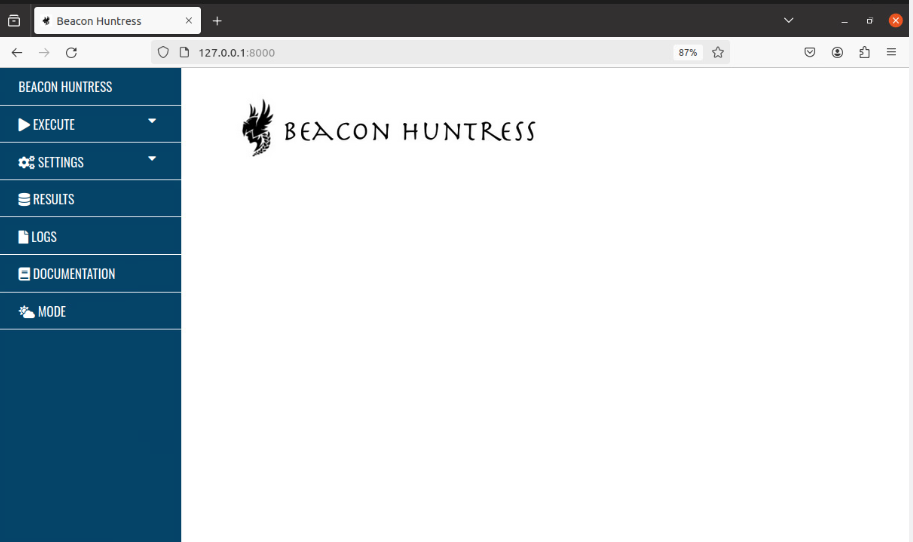
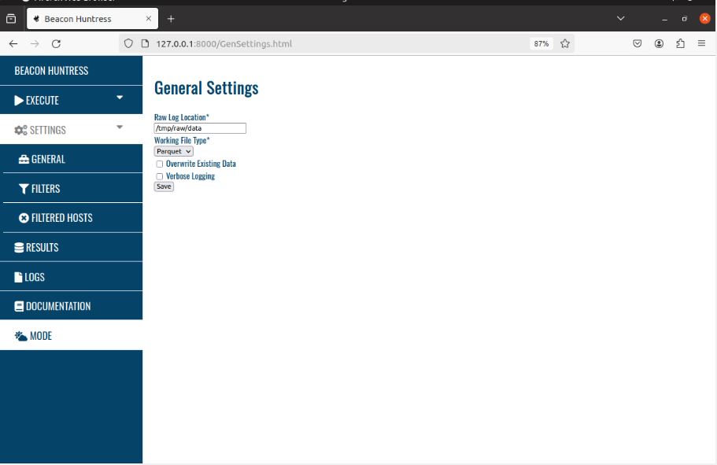
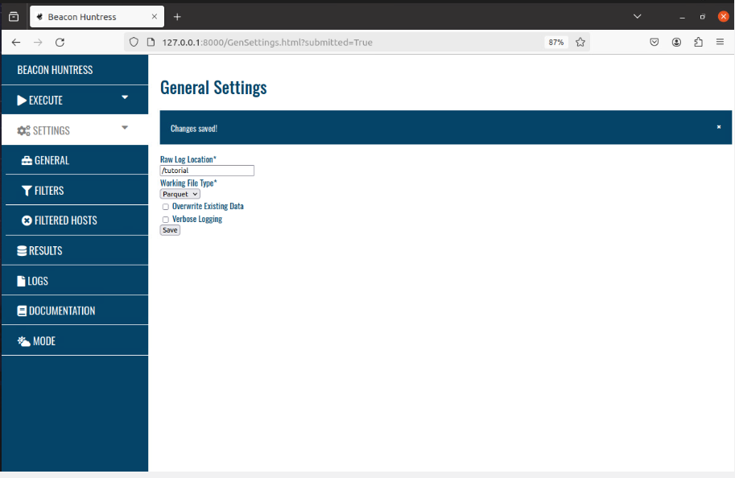
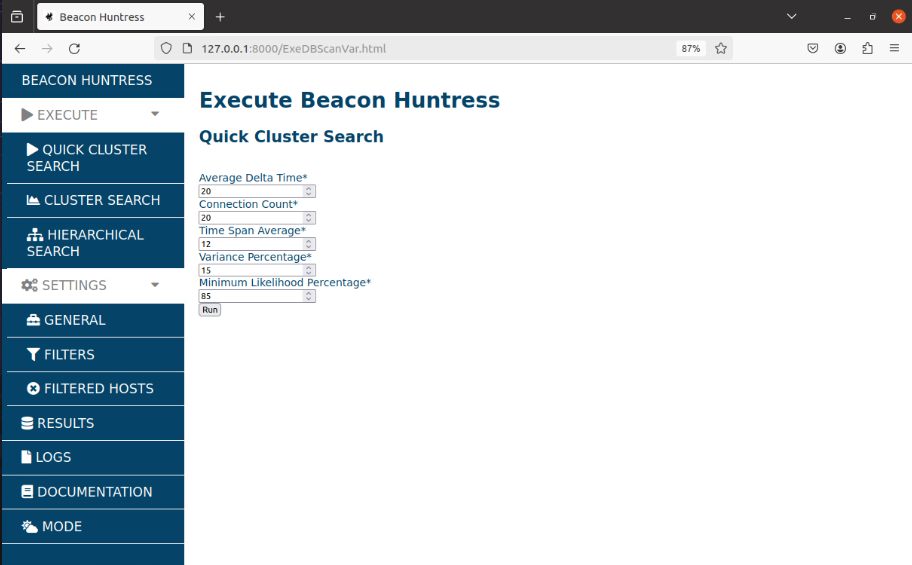
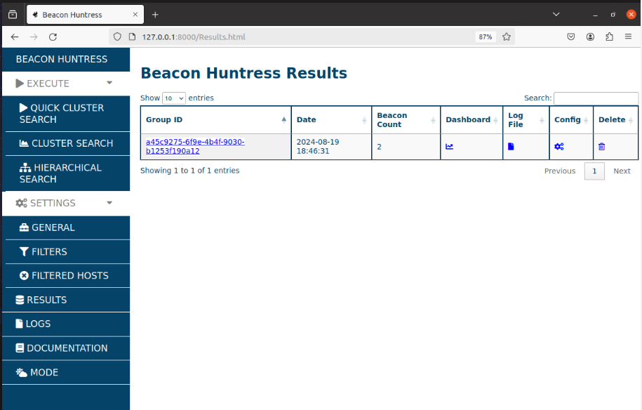
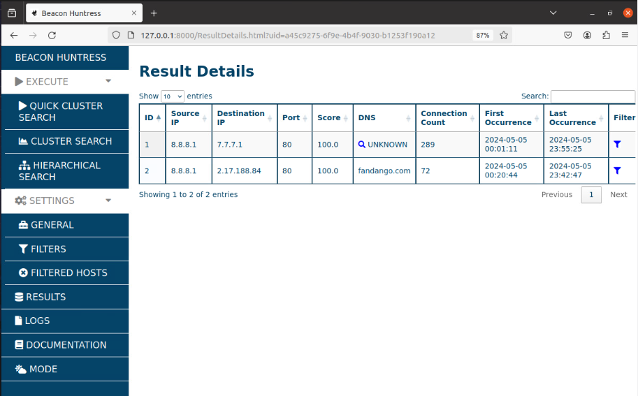
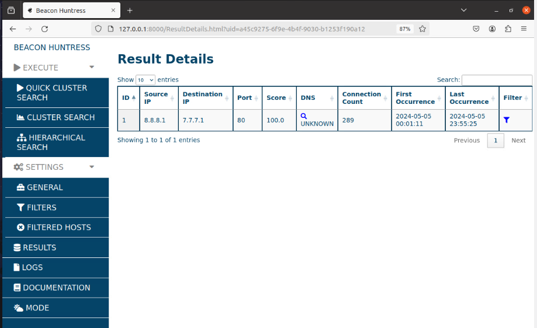
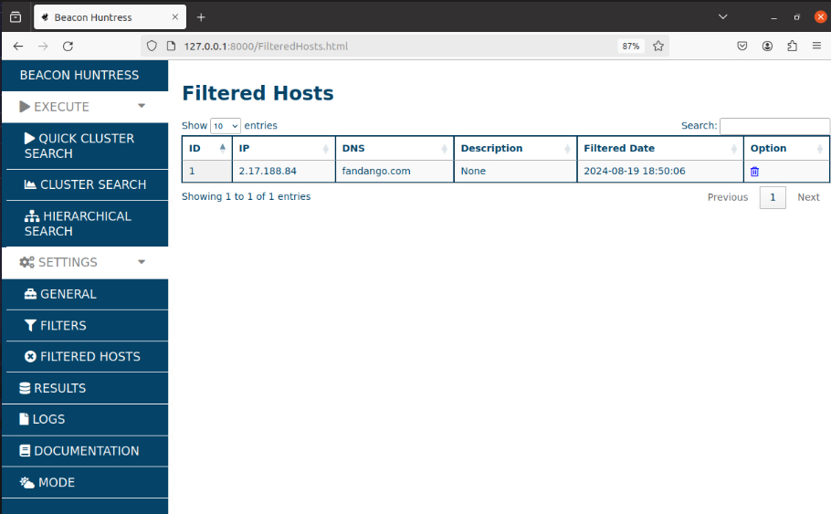
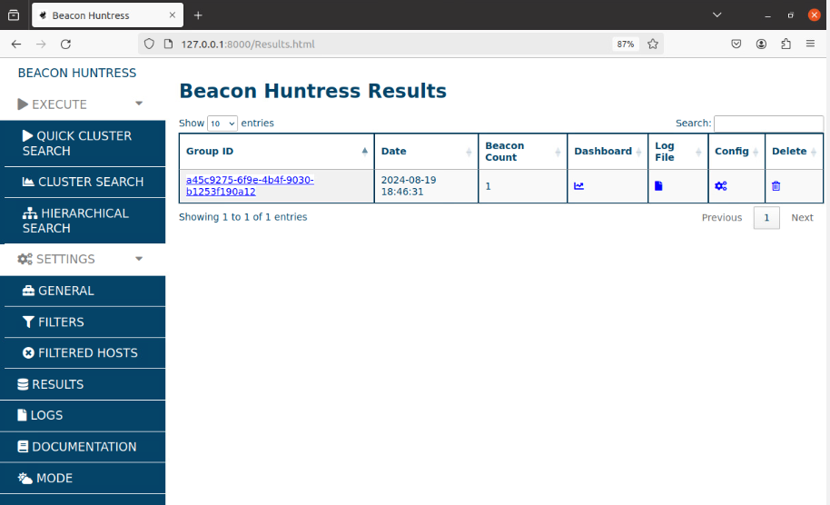
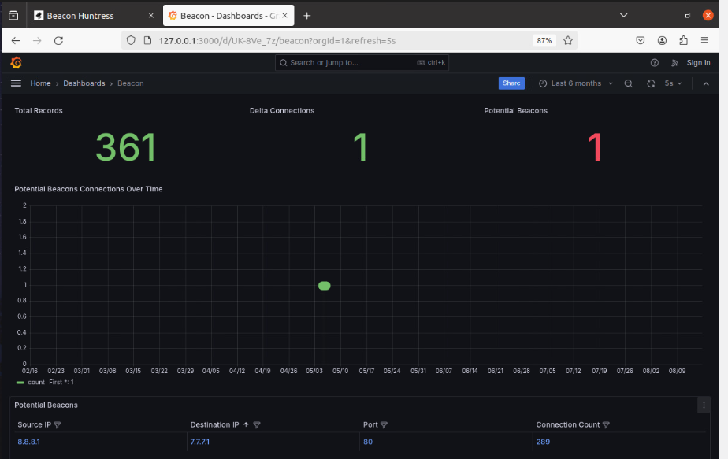

#
## __Table of Contents__

> * [Home](../../../readme.md)
> * [How to use](#howtouse)
>   * [Tutorial](#bh_tutorial)
>   * [Zeek Logs](#zeek)

#
## <a name="bh_tutorial"></a>__Tutorial__

This tutorial will provide an example for running Beacon Huntress using a generic dataset.

> ### __Note__<br>
> 
> You must complete the [Docker Setup](#docker) prior to running this tutorial.

1. Visit http://127.0.0.1:8000 in your web browser to access the main page of the Beacon Huntress Web UI. 

    

2. Go to the "Settings" tab and select "General".

    

3. Change the "Raw Log Location" to ```/tutorial``` and click "Save".

    

4. Go to the "Execute" tab and select "Quick Cluster Search". Keeping the default settings, click "Run". The execution will take a moment.

    

5. After the execution is finished, you'll be redirected to the results page. For this dataset, the "Beacon Count" column shows that two potential beacons have been identified. Several options are now available. Click on the "Group ID" to view the potential beacons. Click the "Dashboard" icon to display results in a Grafana dashboard. Click on the "Log File" icon to view the run logs. Click the "Config" icon to display runtime configuration. Click the "Delete" icon to <i><b>PERMANENTLY</b></i> remove this result set.

    

6. For now, click the "Group ID" to view potential beacons. In this example, Beacon Huntress has identified two potential beacons: 7.7.7.1 and 2.17.188.84, or "fandango.com". The 7.7.7.1 connection is our target test beacon, but the connections to "fandango.com" are benign traffic. Since the identification of "fandango.com" is incorrect, we will exclude this result from the current and future runs by clicking the "Filter" icon.

    

7. Now, the results from "fandango.com" are filtered out.

    

8. To view all your filtered hosts, go to the "Settings" tab and select "Filtered Hosts". Filtered hosts can be removed from this list by clicking the "Trash Can" icon in the "Option" column, which will cause them to once again appear in the results. 

    

9. Go back to the "Results" tab and click on the "Dashboard" icon.

    

10. A Grafana dashboard will open in a new browser tab. See [Dashboard]() for more details on dashboard usage and functionalities.

    

### Congratulations! You have completed your first Beacon Huntress test run!


<br> 


## <a name="zeek"></a>__Zeek Logs__

Zeek Connection Logs must be provided for Beacon Huntress to analyze. Follow the steps below to copy your Zeek logs from their initial location to a local directory that can be accessed by Beacon Huntress. It's recommended to organize the logs into separate directories, with each directory corresponding to a single day.

1. In this example, we will copy Zeek conn logs to the ```/tmp``` directory. The ```/tmp``` directory is mounted to the Docker container beacon_huntress.

    ```bash
    # CREATE DIRECTORY (REPLACE YYYY-MM-DD WITH DATE)
    mkdir -p /tmp/raw/data/YYYY-MM-DD

    # START SFTP SHELL
    sftp root@YOUR_FTP_SERVER

    # SFTP COMMAND EXAMPLE (REPLACE YYYY-MM-DD WITH DATE)
    get -R zeek/logs/YYYY-MM-DD/conn.* /tmp/raw/data/YYYY-MM-DD
    ```

2. In the Beacon Huntress Web UI, go to "Settings" and select "General". Change the "Raw Log Location" to ```/tmp/raw/data``` and click "Save".

    

3. Now when you execute Beacon Huntress, it will return results for potential beacons found in any log files located in ```/tmp/raw/data```. See [tutorial](#tutorial) for more details on understanding Beacon Huntress results.

#
Valkyrie Framework<br>
Copyright 2023 Carnegie Mellon University.<br>
NO WARRANTY. THIS CARNEGIE MELLON UNIVERSITY AND SOFTWARE ENGINEERING INSTITUTE MATERIAL IS FURNISHED ON AN "AS-IS" BASIS. CARNEGIE MELLON UNIVERSITY MAKES NO WARRANTIES OF ANY KIND, EITHER EXPRESSED OR IMPLIED, AS TO ANY MATTER INCLUDING, BUT NOT LIMITED TO, WARRANTY OF FITNESS FOR PURPOSE OR MERCHANTABILITY, EXCLUSIVITY, OR RESULTS OBTAINED FROM USE OF THE MATERIAL. CARNEGIE MELLON UNIVERSITY DOES NOT MAKE ANY WARRANTY OF ANY KIND WITH RESPECT TO FREEDOM FROM PATENT, TRADEMARK, OR COPYRIGHT INFRINGEMENT.
Released under a MIT (SEI)-style license, please see license.txt or contact permission@sei.cmu.edu for full terms.
[DISTRIBUTION STATEMENT A] This material has been approved for public release and unlimited distribution.  Please see Copyright notice for non-US Government use and distribution.<br>
Carnegie Mellon® and CERT® are registered in the U.S. Patent and Trademark Office by Carnegie Mellon University.<br>
DM23-0210<br>