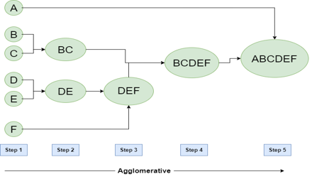
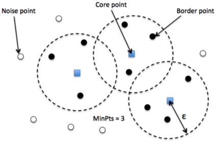

#
## __Table of Contents__

> * [Home](../../../readme.md)
> * [Overview](#overview)
> * [Advanced Search for Beacons](#searchforbeacons)
>   * [Agglomerative Clustering](#agglomerativeclustering)
>   * [DBScan Clustering](#dbscanclustering)
>   * [DBScan by Variance Clustering](#dbscanbyvariance)
>   * [Packet Size Uniqueness](#packetuni)
>   * [Connection Groups](#conngrps)
> * [Examples Beacon Searches](#exbeaconssearch)
>   * [Fast Beacons](#fb)
>   * [Slow Beacons](#sb)

#
## <a name="overview"></a>__Overview__

You can search for beacons by the algorithms below.  The basic idea is to search for slow or fast beacons based upon the time interval and algorithm of your choosing.  The algorithms can be set by using the `cluster_type` option in [config.conf](configuration.md) in order to run the algorithm.  Each algorithm has it's own unique parameters for searching for beacons.  Details about each ML option can be found below.

So, which algorithm should I choose? That depends on what type of beacon you are looking for. Looking for a [Fast Beacon](../../../readme.md#a-idfsbeaconsafastslow-beacon), Agglomerative Clustering or either DBScan would work.<br> Looking for a [Slow Beacon](../../../readme.md#a-idfsbeaconsafastslow-beacon), stick to either of the DBScan algorithms.  Beacon's could also be found by using non-ML algorithms via Packet Size Uniqueness and Connection Groups.

> ### __Note__<br>
> 
> Beacon Huntress default search option is DBScan by Variance with the Slow Beacon parameters used in [dbscan_by_variance()](#dbscanbyvariance).<br>


#
## <a name="searchforbeacons"></a>__Advanced Search for Beacons__

Below are the current algorithms that can be used for searching for beacons.  

> ### __Note__<br>
> 
> The algorithms can be set by using the `cluster_type` option in [config.conf](configuration.md) in order to run the algorithm.  

* [Agglomerative Clustering](#agglomerativeclustering)
    * cluster_type = <i>__agg__</i>
    * When to use = Fast Beacon
* [DBScan Clustering](#dbscanclustering)
    * cluster_type = <i>__dbscan__</i>
    * When to use = Fast or Slow Beacon
* [DBScan by Variance](#dbscanbyvariance)
    * cluster_type = <i>__dbscan_var__</i>
    * When to use = Fast or Slow Beacon
* [Packet Size Uniqueness](#packetuni)
    * cluster_type = <i>__by_packet__</i>
    * When to use = When looking for connections that packet size stays the same.
* [Connection Groups](#conngrps)
    * cluster_type = <i>__by_conn_group__</i>
    * When to use = When looking for connections that have a certain number of connection groups (Destination IP, Source IP, Port & Protocol).

#
## <a name="beaconssearch"></a>__Beacon Searches__

### <a name="agglomerativeclustering"></a>__Agglomerative Clustering__

Agglomerative cluster is a Hierarchical clustering used to group objects in clusters based upon similarity.  Each item is treated as a singleton cluster, working from the bottom up.  Clusters that are similar are merged into a larger cluster.  This process continues until all the clusters are placed into a single large cluster, see image below.  

* Agglomerative cluster works well when searching for [Fast Beacons](../../../readme.md#a-idfsbeaconsafastslow-beacon).
 

<br>image source: https://www.geeksforgeeks.org/hierarchical-clustering-in-data-mining/

### __Parameters__
* __max_variance__ <i>(float)</i><br>
Variance threshold for any potential beacons.<br>

* __min_records__ <i>(int)</i><br>
Minimum number of delta records to search.<br>

* __cluster_factor__ <i>(float)</i><br>
The likelihood percentage for a cluster.<br>

* __line_amounts__ <i>(list)</i><br>
Line amounts to process at a time, in list format.<br>

* __min_delta_time__ <i>(string)</i><br>
Minimum delta time to search by, in milliseconds.<br>

Below are two options that can be used to find a fast or slow beacon using Agglomerative clustering.

> ### __Note__<br>
> 
> Agglomerative clustering is __NOT__ a recommended algorithm for searching for Slow Beacons.<br>


#### __Fast Beacon Search__
Searching for beacons with 70% likelihood, 12% max variance, at least 10 connections, and delta time of 60 seconds.
```yaml
  agg:
    max_variance: .12
    min_records: 10
    cluster_factor: .70
    line_amounts: [1]
    min_delta_time: 60000
```

#### __Slow Beacon Search__
Searching for beacons with 70% likelihood, 12% max variance, at least 10 connections, and delta time of 15 minutes.
```yaml
  agg:
    max_variance: .12
    min_records: 10
    cluster_factor: .70
    line_amounts: [1]
    min_delta_time: 900000
```

#
### <a name="dbscanclustering"></a>__DBScan Clustering__

DBScan stands for Density-Based Spatial Clustering of Applications with Noise.  DBScan discovers clusters of different sizes from a large amount of data that contains noise and outliers, see image below.  DBScan primarily uses two parameter Minimum Points and ESP (Epsilion).  Minimum points are the minimum number of points (a threshold) clustered together for a region to be considered dense.  EPS is the distance measure that will be used to locate the points for a cluster.

* DBScan cluster is a good choice for searching either [Fast Beacons](../../../readme.md#a-idfsbeaconsafastslow-beacon) or [Slow Beacons](../../../readme.md#a-idfsbeaconsafastslow-beacon).  However, this is the slowest running algorithim.
 


<br>image source: https://www.kdnuggets.com/2020/04/dbscan-clustering-algorithm-machine-learning.html

### __Parameters__
* __minimum_delta__ <i>(int)</i><br>
Minimum number of delta records to search using your delta column.<br>

* __spans__ <i>(list)</i> <br>
Spans you wish to search, in list format. Minimum number of delta records to search using your delta column.<br>
<i>EXAMPLE: Will search two spans 0-5 and 5-10.<br>
    <t>[[0, 5], [5, 10]]</i><br>

* __minimum_points_in_cluster__ <i>(int)</i><br>
Destination file type (csv or parquet).<br>

* __minimum_likelihood__ <i>(float)</i> <br>
Minimum likelihood value to identify a beacon.<br>

Below are two options that can be used to find a fast or slow beacon using DBScan clustering.

#### __Fast Beacon Search__
Searching for beacons with 70% likelihood, time spans (0-5 mins, 2-15 mins, 15-35 mins, 30-60 mins), at least 10 connections, and min delta time of 60 seconds.
```yaml
  dbscan:
    minimum_delta: 1
    spans: [[0, 5], [2, 15], [15, 35], [30, 60]]
    minimum_points_in_cluster: 10
    minimum_likelihood: 0.70
```

#### __Slow Beacon Search__
Searching for beacons with 70% likelihood, time spans (0-5 mins, 2-15 mins, 15-35 mins, 30-60 mins), at least 10 connections, and min delta time of 20 minutes.
```yaml
  dbscan:
    minimum_delta: 20
    spans: [[0, 5], [2, 15], [15, 35], [30, 60]]
    minimum_points_in_cluster: 10
    minimum_likelihood: 0.70
```

#
### <a name="dbscanbyvariance"></a>__DBScan by Variance Clustering__

DBScan by variance uses the same principals as [DBScan Clustering](#dbscanclustering) but will exclude the amount of records that is needed to be scanned by variance and spans are generated based upon the percentage given.  If the variance is outside of the configured threshold it is excluded from the scan.  This feature provides all the benefits of a DBScan without the performance overhead.

* DBScan by Variance cluster is a good choice for searching either [Fast Beacons](../../../readme.md#a-idfsbeaconsafastslow-beacon) or [Slow Beacons](../../../readme.md#a-idfsbeaconsafastslow-beacon). 
  * This provides a perfomance increase over DBScan for connections are filtered prior by a variance setting.

### __Parameters__
* __avg_delta__ <i>(int)</i><br>
Average delta time to include in the search using your delta column. Less than equal (<>=).<br>

* __conn_cnt__ <i>(int)</i><br>
Total connection count for filtering. Greater than equal (>=).<br>

* __span_avg__ <i>(int)</i> <br>
The percentage to increase and decrease from the connections total delta span.<br>
<i>EXAMPLE: 15 will decrease 15% from the minimum and maximum delta span.<br>
    <t>min delta = 5<br>
    <t>max delta = 10<br>
    <t>span min = 4.25 (5 - (5 * 15%))<br>
    <t>span max = 11.5 (10 + (10 * 15%))</i><br>

* __variance_per__ <i>(int)</i><br>
Total variance perctage for filtering. Greater than equal (>=).<br>
__Default__ = 4<br>

* __minimum_likelihood__ <i>(int)</i> <br>
Minimum likelihood value to identify a beacon.<br>

Below are two options that can be used to find a fast or slow beacon using DBScan by variance clustering.

#### __Fast Beacon Search__
Searching for beacons with 70% likelihood, at least 10 connections, 15% span average, min variance 15% and min delta time of 1 minute.
```yaml
  dbscan_var:
    avg_delta: 1 
    conn_cnt: 10 
    span_avg: 15
    variance_per: 15
    minimum_likelihood: 70
```

#### __Slow Beacon Search__
Searching for beacons with 70% likelihood, at least 10 connections, 15% span average, min variance 15% and min delta time of 20 minutes.<br>
Note this will also search for fast beacons as avg_delta <=
```yaml
  dbscan_var:
    avg_delta: 20
    conn_cnt: 10 
    span_avg: 15
    variance_per: 15
    minimum_likelihood: 70
```

#
### <a name="packetuni"></a>__Packet Size Uniqueness__

Packet size uniqueness is a non-ML scan that will determine the amount of traffic that appears to be unique by using packet sizing.  For example, if we have 10 connections and out of those 10 connections, 9 connections have the same packet size for original packet size and response packet size.  Therefore our packet size uniqueness is 10% because only 1 out of 10 has a different packet size.  

* Packet size uniqueness is used when trying to find beacons by the the amount of unique traffic. Works well finding beacons with same groupings (Destination IP, Source IP, Port & Protocol) but on different time intervals.


### __Parameters__
* __avg_delta__ <i>(int)</i><br>
Average delta time to include in the search using your delta column. Less than equal (<=).<br>

* __conn_cnt__ <i>(int)</i><br>
Total connection count for filtering. Greater than equal (>=).<br>

* __min_unique_percent__ <i>(int)</i> <br>
The min percentage of packet size uniqueness per connection group.<br>

Below are the default parameters.

#### __Default Options__
Searching for beacons with an average delta time of 15 minutes, at least 10 connections, and 2% packet size uniqueness.
```yaml
  by_packet:
    avg_delta: 15
    conn_cnt: 10
    min_unique_percent: 2
```   

#
### <a name="conngrps"></a>__Connection Groups__

Connection groups is a non-ML scan that will determine the amount of traffic based upon the number of connection groups by a time threshold.  Connection groups are Source IP, Destination IP, Destination Port and Protocol.  For example over the course of a day we want to see all the connection groups that have at least 10 connections per 60 mins and had this activity repeat 5 times through out the day.  Connection groups are not bound to an average delta threshold, but the range of data in the delta/silver file.

* Connection groups are used when trying to find beacons without delta time thresholds.

### __Parameters__
* __conn_cnt__ <i>(int)</i><br>
Total connection count for filtering. Greater than equal (>=).<br>

* __conn_grp__ <i>(int)</i><br>
Total number of connections groups. Greater than equal (>=).<br>

* __threshold__ <i>(int)</i> <br>
The time threshold when determining connection groups.  Threshold is in mins.<br>

Below are the default parameters.

#### __Default Options__
Searching for beacons with an average connect group of 10 connections per 60 minutes repeated 5 times..
```yaml
  by_conn_group:
    conn_cnt: 10
    conn_group: 5
    threshold: 60
```

#
## <a name="exbeaconssearch"></a>__Example Beacon Searches__

### <a name="fb"></a>__Fast Beacons__

#### __Agglomerative Clustering__
```yaml
  agg:
    max_variance: .12
    min_records: 10
    cluster_factor: .70
    line_amounts: [1]
    min_delta_time: 60000
```

#### __DBScan__
```yaml
  dbscan:
    minimum_delta: 1
    spans: [[0, 5], [2, 15], [15, 35], [30, 60]]
    minimum_points_in_cluster: 10
    minimum_likelihood: 0.70
```

#### __DBScan by Variance__
```yaml
  dbscan_var:
    avg_delta: 1 
    conn_cnt: 10 
    span_avg: 15
    variance_per: 15
    minimum_likelihood: 70
```

#### __Packet Size Uniqueness__
```yaml
  by_packet:
    avg_delta: 4
    conn_cnt: 10
    min_unique_percent: 2
```   

#### __Connection Groups__
```yaml
  by_conn_group:
    conn_cnt: 10
    conn_group: 5
    threshold: 4
```

### <a name="sb"></a>__Slow Beacons__

#### __Agglomerative Clustering__
```yaml
  agg:
    max_variance: .12
    min_records: 10
    cluster_factor: .70
    line_amounts: [1]
    min_delta_time: 900000
```

#### __DBScan__
```yaml
  dbscan:
    minimum_delta: 20
    spans: [[0, 5], [2, 15], [15, 35], [30, 60]]
    minimum_points_in_cluster: 10
    minimum_likelihood: 0.70
```

#### __DBScan by Variance__
```yaml
  dbscan_var:
    avg_delta: 20
    conn_cnt: 10 
    span_avg: 15
    variance_per: 15
    minimum_likelihood: 70
```

#### __Packet Size Uniqueness__
```yaml
  by_packet:
    avg_delta: 20
    conn_cnt: 10
    min_unique_percent: 2
```   

#### __Connection Groups__
```yaml
  by_conn_group:
    conn_cnt: 10
    conn_group: 5
    threshold: 60
```


#
Valkyrie Framework<br>
Copyright 2023 Carnegie Mellon University.<br>
NO WARRANTY. THIS CARNEGIE MELLON UNIVERSITY AND SOFTWARE ENGINEERING INSTITUTE MATERIAL IS FURNISHED ON AN "AS-IS" BASIS. CARNEGIE MELLON UNIVERSITY MAKES NO WARRANTIES OF ANY KIND, EITHER EXPRESSED OR IMPLIED, AS TO ANY MATTER INCLUDING, BUT NOT LIMITED TO, WARRANTY OF FITNESS FOR PURPOSE OR MERCHANTABILITY, EXCLUSIVITY, OR RESULTS OBTAINED FROM USE OF THE MATERIAL. CARNEGIE MELLON UNIVERSITY DOES NOT MAKE ANY WARRANTY OF ANY KIND WITH RESPECT TO FREEDOM FROM PATENT, TRADEMARK, OR COPYRIGHT INFRINGEMENT.
Released under a MIT (SEI)-style license, please see license.txt or contact permission@sei.cmu.edu for full terms.
[DISTRIBUTION STATEMENT A] This material has been approved for public release and unlimited distribution.  Please see Copyright notice for non-US Government use and distribution.<br>
Carnegie Mellon® and CERT® are registered in the U.S. Patent and Trademark Office by Carnegie Mellon University.<br>
DM23-0210<br>