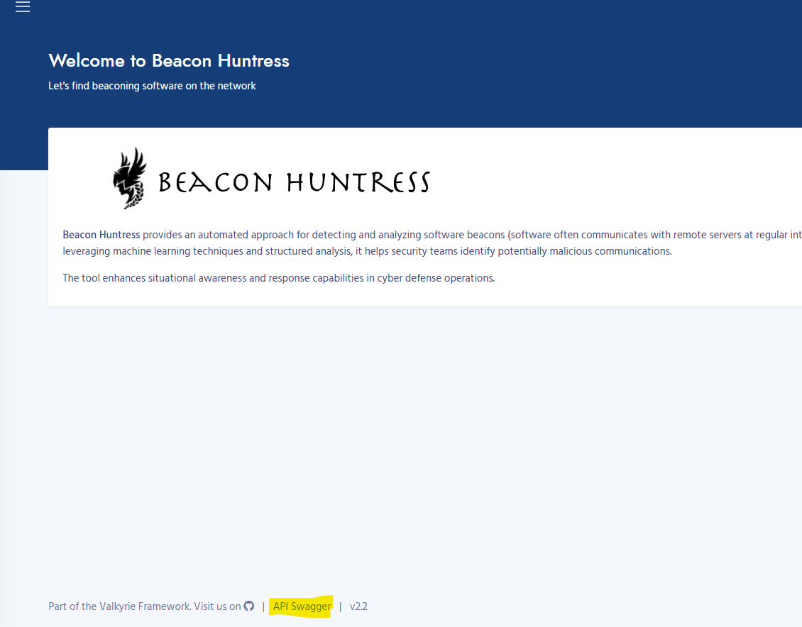
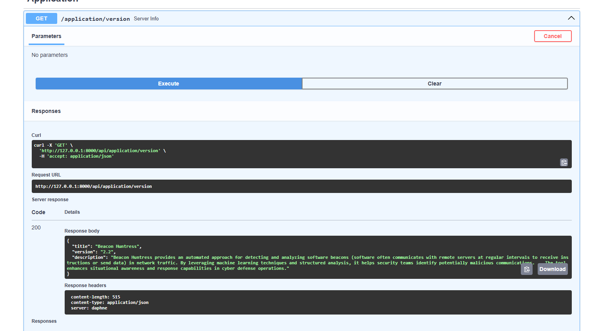

# Beacon Huntress API

API has been added for

- API
    - Application
        - [Version](#version)
        - [Configuration](#configuration)
    - Searches
        - [Quick Cluster](#quick-cluster)
        - [Detail Cluster](#detail-cluster)
        - [Hierarchical](#hierarchical)
    - Results
        - [Beacon Groups](#beacon-groups)
        - [Beacon Results](#beacon-results)
        - [Log File](#log-file)
        - [Filter Beacon](#filter-beacon)
- [Interactive API Docs](#interactive-api-docs)
- Coding Example
    - [Run a Beacon Search](#run-a-beacon-search)

## Application

### Version

Beacon Huntress version

- **Return Values**
    - **title:** Application title
    - **version:** Beacon Huntress version number
    - **description:** Beacon Huntress description
- **Example Code**
    ```python
    import requests

    url = "http://127.0.0.1:8000/api/application/version"

    response = requests.get(url)
    val = response.json()
    print(val)
    ```

### Configuration

Beacon Huntress configuration

- **Return Values**
    - **Beacon Huntress Configuration:** Beacon Huntress Configuration
- **Example Code**
    ```python
    import requests

    url = "http://127.0.0.1:8000/api/application/configuration"

    response = requests.get(url)
    val = response.json()
    print(val)
    ```

## Searches

### Quick Cluster

Run Beacon Huntress quick cluster search.

- **Input Values**
    - **log_type:** Log Type parameter (Zeek Connection = conn)
    - **log_dir:** Log directory location
    - **delta:** Average callback time in minutes
    - **call_back:** The minimum number of connection callbacks
    - **percent:** The minimum percentage of cluster points
    - **span_avg:** The percentage for the span of EPS
    - **variance:** The maximum percentage of jitter that is allowed
    - **start_dte:** The start date time
    - **end_dte:** The end date time
    - **zip:** Is the file a zip file (True or False)
    - **verbose:** Verbose logging (True of False)
- **Return Values**
    - **beacon_group:** Beacon Huntress run results group
    - **cnt:** Number of potential beacons
    - **log_file:** Beacon Huntress run results log file
- **Example Code**
    ```python
    import requests
    import json

    url = "http://127.0.0.1:8000/api/searches/quick_cluster"
    payload = {
    "log_type": "conn",
    "log_dir": "/tutorial",
    "delta": 20,
    "call_back": 10,
    "percent": 85,
    "span_avg": 12,
    "variance": 15,
    "start_dte": "",
    "end_dte": "",
    "zip": False,
    "verbose": False
    }
    payload = json.dumps(payload)

    response = requests.post(url, data=payload)
    val = response.json()
    print(val)
    ```

### Detail Cluster

Beacon Huntress detailed cluster search.

- **Input Values**
    - **log_type:** Log Type parameter (Zeek Connection = conn)
    - **log_dir:** Log directory location
    - **delta:** Average callback time in minutes
    - **call_back:** The minimum number of connection callbacks
    - **percent:** The minimum percentage of cluster points
    - **spans:** The time spans to search in list form (e.g [[0, 5], [2, 15], [15, 35], [30, 60]])
    - **variance:** The maximum percentage of jitter that is allowed
    - **start_dte:** The start date time
    - **end_dte:** The end date time
    - **zip:** Is the file a zip file (True or False)
    - **verbose:** Verbose logging (True of False)
- **Return Values**
    - **beacon_group:** Beacon Huntress run results group
    - **cnt:** Number of potential beacons
    - **log_file:** Beacon Huntress run results log file
- **Example Code**
    ```python
    import requests
    import json

    url = "http://127.0.0.1:8000/api/searches/detailed_cluster"
    payload = {
    "log_type": "conn",
    "log_dir": "/tutorial",
    "delta": 20,
    "time_spans": [
        [0,5],
        [2,15],
        [15,35],
        [30,60]
        ],
    "call_back": 10,
    "percent": 85,
    "start_dte": "",
    "end_dte": "",
    "zip": False,
    "verbose": False
    }
    payload = json.dumps(payload)

    # Run Quick Cluster Search
    response = requests.post(url, data=payload)
    val = response.json()
    print(val)
    ```

### Hierarchical

Beacon Huntress hierarchical search.

- **Input Values**
    - **log_type:** Log Type parameter (Zeek Connection = conn)
    - **log_dir:** Log directory location
    - **delta:** Average callback time in minutes
    - **line_amounts:** The amount of lines to process (e.g. [1])
    - **call_back:** The minimum number of connection callbacks
    - **variance:** The maximum percentage of jitter that is allowed
    - **percent:** The minimum percentage of cluster points
    - **start_dte:** The start date time
    - **end_dte:** The end date time
    - **zip:** Is the file a zip file (True or False)
    - **verbose:** Verbose logging (True of False)
- **Return Values**
    - **beacon_group:** Beacon Huntress run results group
    - **cnt:** Number of potential beacons
    - **log_file:** Beacon Huntress run results log file
- **Example Code**
    ```python
    import requests
    import json

    url = "http://127.0.0.1:8000/api/searches/hierarchical"
    payload = {
    "log_type": "conn",
    "log_dir": "/tutorial",
    "delta": 20,
    "line_amounts": [
        1
    ],
    "call_back": 10,
    "variance": 15,
    "percent": 85,
    "start_dte": "",
    "end_dte": "",
    "zip": False,
    "verbose": False
    }
    payload = json.dumps(payload)

    # Run Quick Cluster Search
    response = requests.post(url, data=payload)
    val = response.json()
    print(val)
    ```

## Results

### Beacon Groups

Get Beacon Huntress search groups.

- **Return Values**
    - **beacon_group:** Results group_id to be used for /beacon_groups
    - **date:** Date of search
    - **beacon_count:** Number of potential beacons
    - **log_file:** Results log_file name to used for get_log_file
- **Example Code**
    ```python
    import requests

    url = "http://127.0.0.1:8000/api/results/beacon_groups"

    response = requests.get(url)
    val = response.json()
    print(val)
    ```

### Beacon Results

Get or Delete Beacon Results

- **Input Values**
    - **beacon_group:** Beacon Group UUID
- **Return Values**
    - **ID:** Unique row identifier
    - **Source IP:** Source IP address
    - **Destination IP:** Destination IP address
    - **Port:** Destination Port ID
    - **Score:** Clustered score
    - **DNS:** DNS name
    - **Connection Count:** Number of connection for each unique Source IP, Destination IP and Port.
    - **First Occurrence:** Minimum date for each unique Source IP, Destination IP and Port.
    - **Last Occurrence:** Maximum date for each unique Source IP, Destination IP and Port.
- **Example Code**
    ```python
    import requests

    url = "http://127.0.0.1:8000/api/results/beacon_results"

    # Get Results
    response = requests.get(url, params={"beacon_group": "9a42fb53-ceac-44b2-afae-d89d133679e2"})

    # Delete Results
    #response = requests.delete(url, params={"beacon_group": "9a42fb53-ceac-44b2-afae-d89d133679e2"})

    val = response.json()
    print(val)
    ```

### Log File

Get or Delete Log File

- **Input Values**
    - **log_file:** Beacon run log file
- **Return Values**
    - **file_content:** Log file content
- **Example Code**
    ```python
    import requests

    url = "http://127.0.0.1:8000/api/results/log_file"

    # Get Log File
    response = requests.get(url, params={"log_file": "log_1752679403"})

    # Delete Log File
    #response = requests.delete(url, params={"log_file": "log_1752679403"})

    val = response.json()
    print(val)
    ```

### Filter Beacon

Get, Add or Delete Filtered Hosts

- **Input Values (Add or Delete)**
    - **ip:** IP to filter
- **Return Values**
    - **Add**
        - **Filtered:** Boolean
        - **Message:** Short description
    - **Deleted**
        - **Deleted:** Boolean
        - **Message:** Short description
    - **Get**
        - **IP:** Filter host IP
        - **DNS:** Dns name
        - **Description:** Description for filtered host
        - **Filtered_Date:** Date of filtered host
- **Example Code**
    ```python
    import requests

    url = "http://127.0.0.1:8000/api/results/filter_host"

    # Get Filtered Host
    response = requests.get(url)

    # Add Filtered Host
    #response = requests.post(url, params={"ip": "2.17.188.84"})

    # Delete Filtered Host
    #response = requests.delete(url, params={"ip": "2.17.188.84"})

    print(response.text)
    ```

## Interactive API Docs

1. To access the interactive API docs click on the [API Swagger](http://127.0.0.1:8000/api/docs) link at the bottom of the page



2. From the docs page you can run any of the api by expanding the requst, clicking the Try it out button, then the execute button and if successful you will receive a response body.



## Coding Example

Below is an example of running a beacon searching using the API.

### Run a Beacon Search

Quick cluster search with the tutorial data.

```python
import requests
import json

url = "http://127.0.0.1:8000/api/searches/quick_cluster"
payload = {
  "log_type": "conn",
  "log_dir": "/tutorial",
  "delta": 20,
  "call_back": 10,
  "percent": 85,
  "span_avg": 12,
  "variance": 15,
  "start_dte": "",
  "end_dte": "",
  "zip": False,
  "verbose": False
}
payload = json.dumps(payload)

# Run Quick Cluster Search
response = requests.post(url, data=payload)
val = response.json()

# Get Results
url = "http://127.0.0.1:8000/api/results/beacon_results"
response = requests.get(url,params={"beacon_group": val["beacon_group"]})
print(val["beacon_group"])
print(response.text)
```