# Beacon Huntress <a name="datasource"></a>Data Sources

Beacon Huntress now has the ability to store data sources to allow repeatable usage. Current data types are Zeek Connection Logs, Elastic Indices, and Security Onion Indices. Beacon Huntress defaults to the Zeek Connection Logs data source, which allows the user to select their raw Zeek connection logs. For details on setting up an [API Key](#api), please click the link.

## <a name="elastic"></a>**Elastic**

The Elastic data source will use Zeek connection logs contained inside of the application. The indices will be manually selected. Click the link for details on setting up an [API](#api).

To create an Elastic data source, follow the steps below.

1. Under "Settings" click "Data Sources".
2. Click the "New" button.

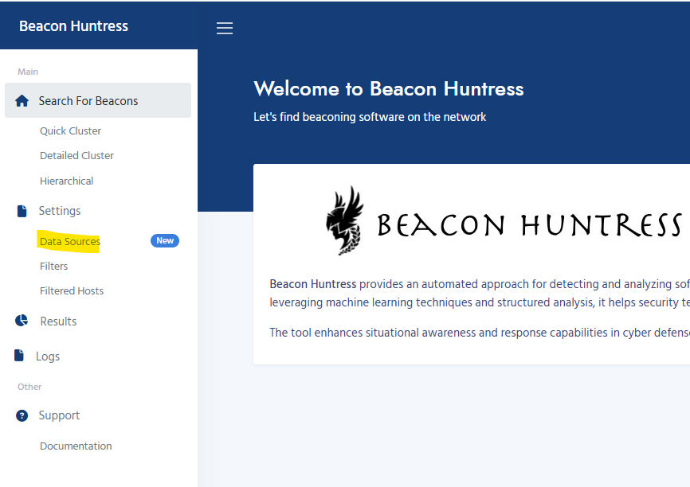

3. Select "Elastic" in the "Data Source Type" drop-down list.

   - The following inputs are required for Elastic:

     - **Data Source Name**
       - Unique name for your data source.<br>
     - **Host**
       - Elastic Host Name.<br>
     - **Port**
       - Elastic Port Name.<br>
     - **API Key**
       - Elastic API Name.<br>
       - API Key can be viewed by clicking the eye button.
     - **Index**
       - Elastic Index Name (Multi-Select).<br>
       - Click the button to load the indices. <b><i>You must have the correct Host, Port and API Key in order to load the indices.</b></i>

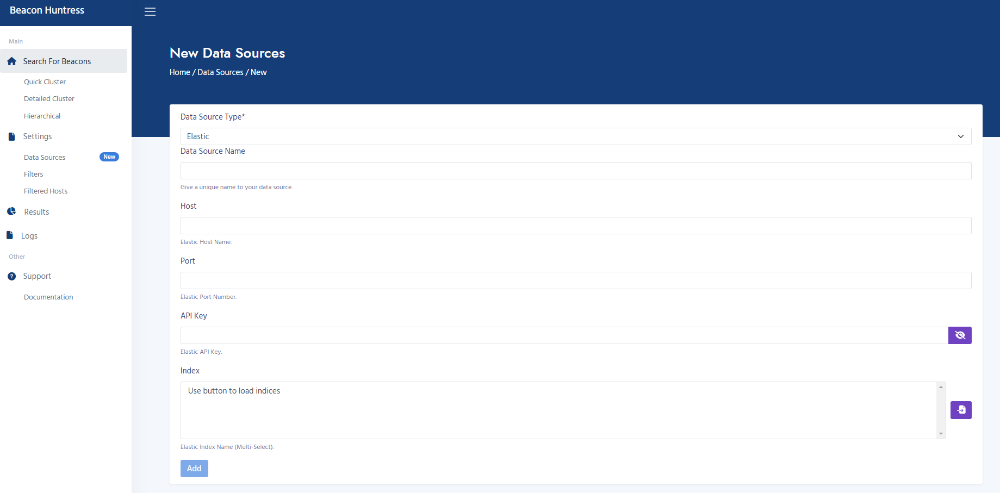

4. Click the "Add" button to create the new data source.

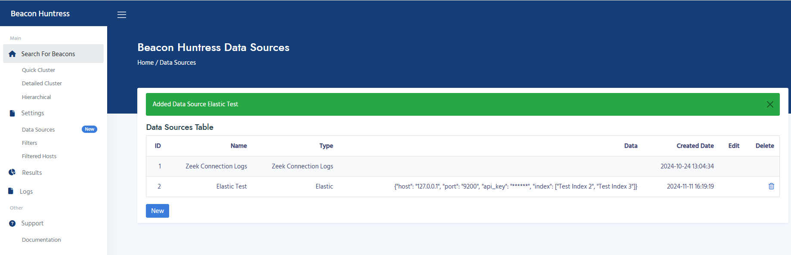

5. The new data source will now be available for any "Search For Beacon" data source.

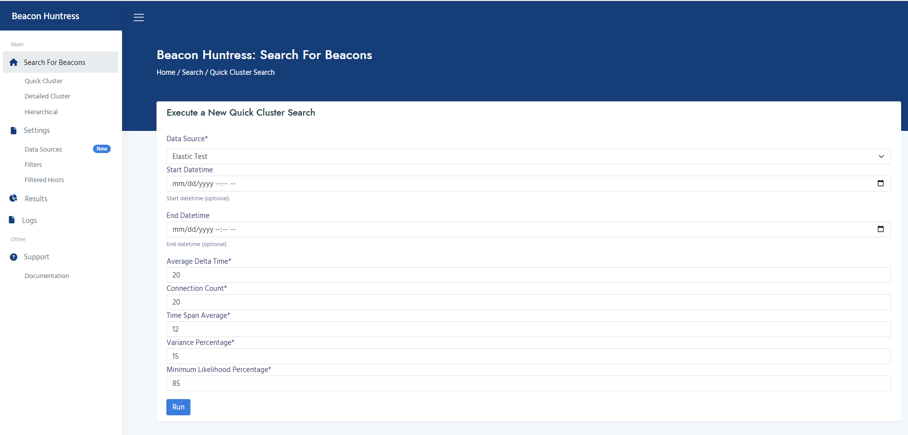

## <a name="seconion"></a>**Security Onion**

The Security Onion data source will use Zeek connection logs contained inside of the application. The indices will be automatically selected. Click the link for details on setting up an [API](#api).

1. Under "Settings" click "Data Sources".
2. Click the "New" button.

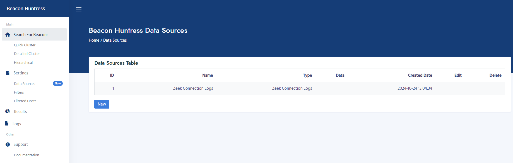

3. Select "Elastic" in the "Data Source Type" drop-down list.

   - The following inputs are required for Security Onion:

     - **Data Source Name**
       - Unique name for your data source.<br>
     - **Host**
       - Security Onion Elastic Host Name.<br>
     - **Port**
       - Security Onion Elastic Port Name.<br>
     - **API Key**
       - Security Onion Elastic API Name.<br>
       - API Key can be viewed by clicking the eye button.

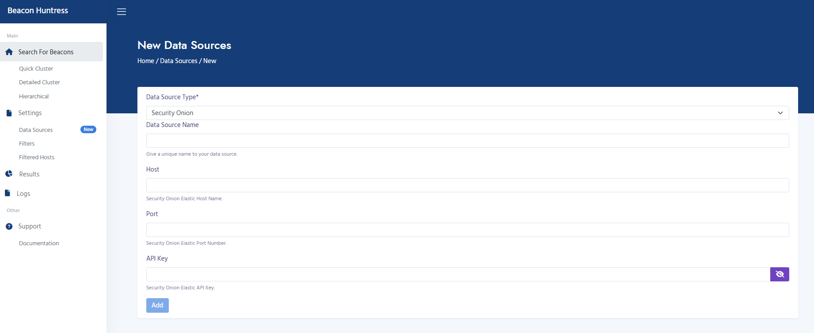

4. Click "Add" button to create the new data source.

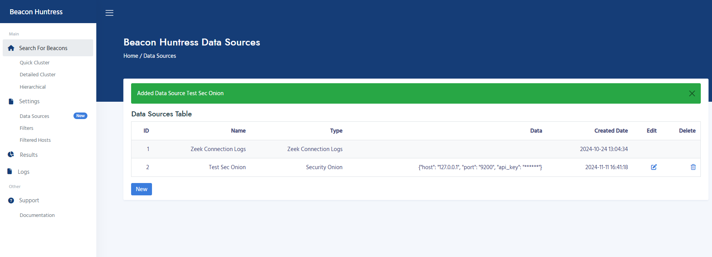

5. The new data source will now be available for any "Search For Beacon" data source.


## <a name="zeek"></a>**Zeek Logs**

Zeek Connection Logs must be provided for Beacon Huntress to analyze. Follow the steps below to copy your Zeek logs from their initial location to a local directory that can be accessed by Beacon Huntress. It's recommended to organize the logs into separate directories, with each directory corresponding to a single day.

1. In this example, we will copy Zeek connection logs to the `/zeek` directory. The `/zeek` directory is mounted to the Docker container beacon_huntress.

   ```bash
   # CREATE DIRECTORY (REPLACE YYYY-MM-DD WITH DATE)
   mkdir -p /zeek/raw/data/YYYY-MM-DD

   # START SFTP SHELL
   sftp root@YOUR_FTP_SERVER

   # SFTP COMMAND EXAMPLE (REPLACE YYYY-MM-DD WITH DATE)
   get -R zeek/logs/YYYY-MM-DD/conn.* /zeek/raw/data/YYYY-MM-DD
   ```

2. Under "Settings" click "Data Sources".
3. Click the "New" button.

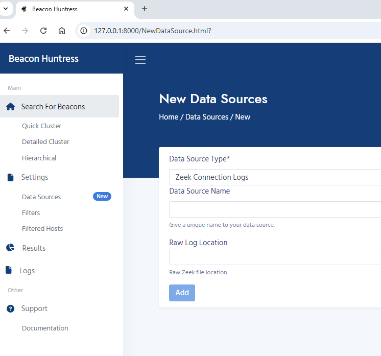

- The following inputs are required for Zeek Connection Logs:

  - **Data Source Name**
    - Unique name for your data source.<br>
  - **Raw Log Location**
    - Raw Zeek file location.<br>

4. Click "Add" button to create the new data source.

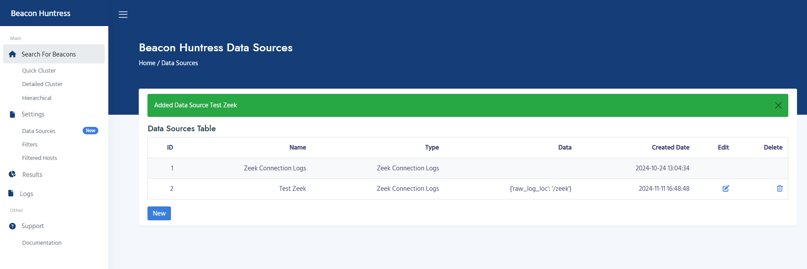

5. The new data source will now be available for any "Search For Beacon" data source.

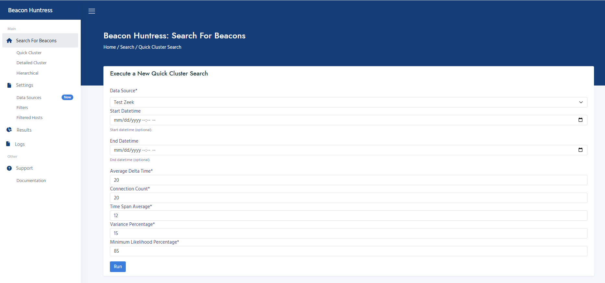

## <a name="api"></a>**Create Elastic API**

Elastic and Security Onion data sources can be accessed by using the Elastic API. In order to use these data sources you must set up an Elastic API Key.

???+ tip "Note"

    Elastic Indices must be Zeek Connection Logs. Beacon Huntress only works with Zeek Connection Logs.

1. From the Elastic Management Console, navigate to "Security" then "API Keys".

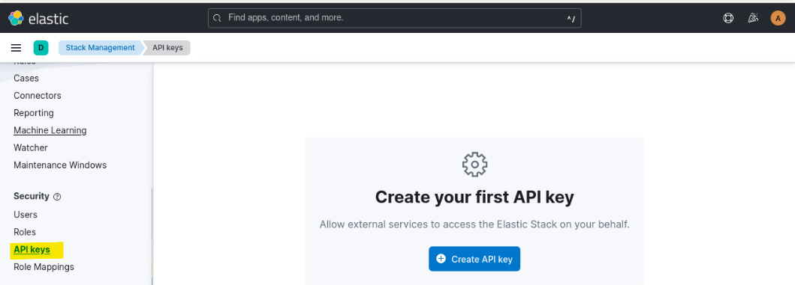

2. Click on the "Create API Key" button.

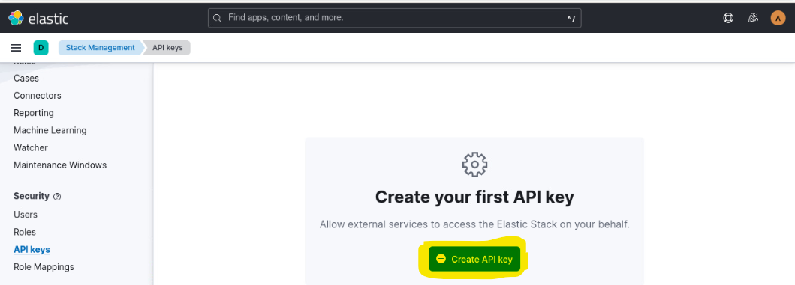

3. Give the API key the name "bh_api" and restrict permissions according to your organization's security policies. Finally, click the "Create API Key" button.

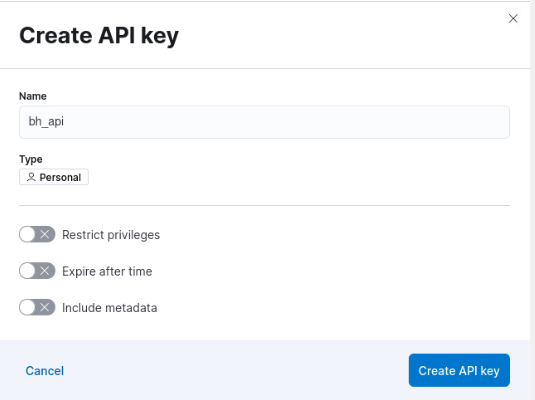

4. Copy the API key for Beacon Huntress usage.

???+ tip "Note"

    Once you leave the screen, the API key will not be retrievable. Best practice is to store the API key in a password safe.

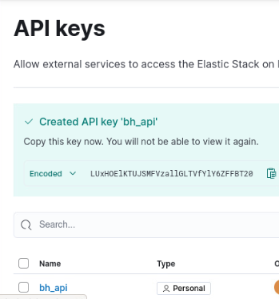
