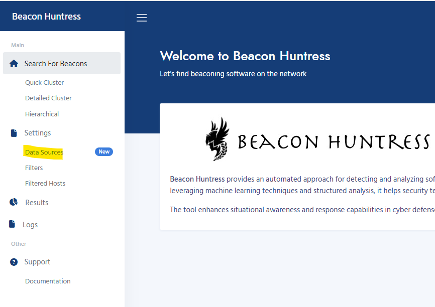
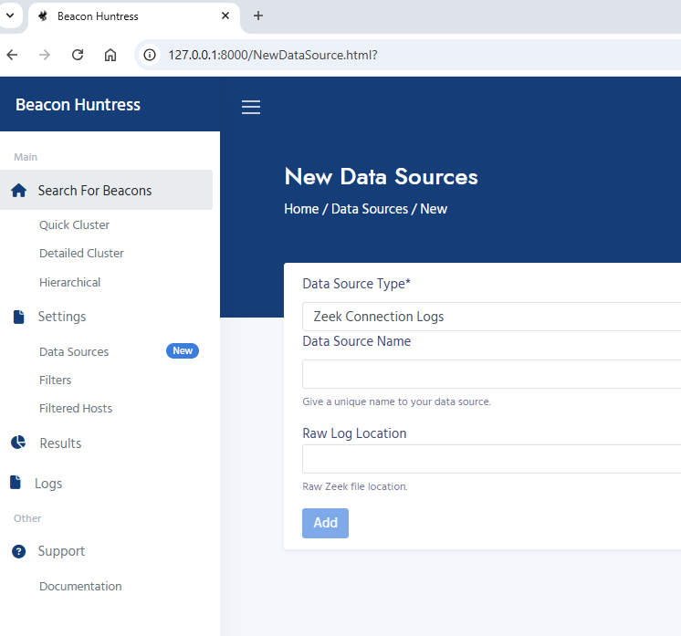
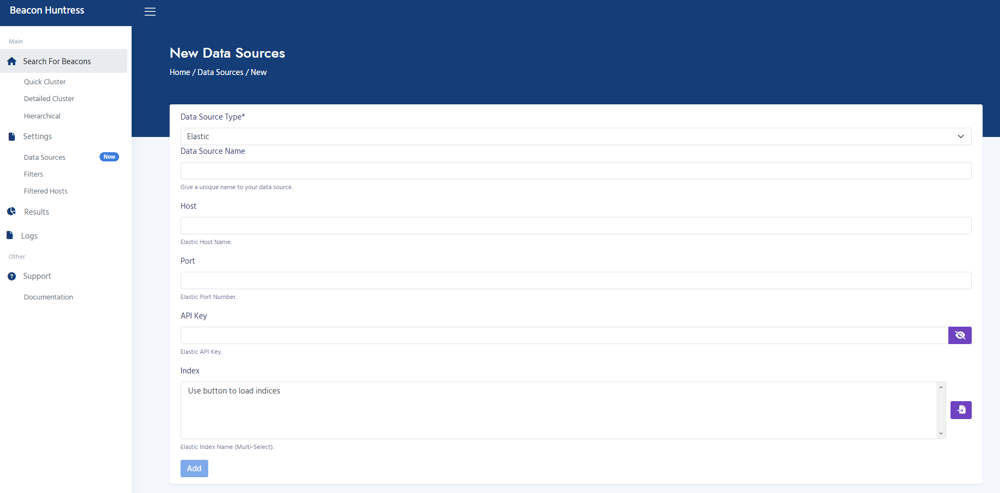
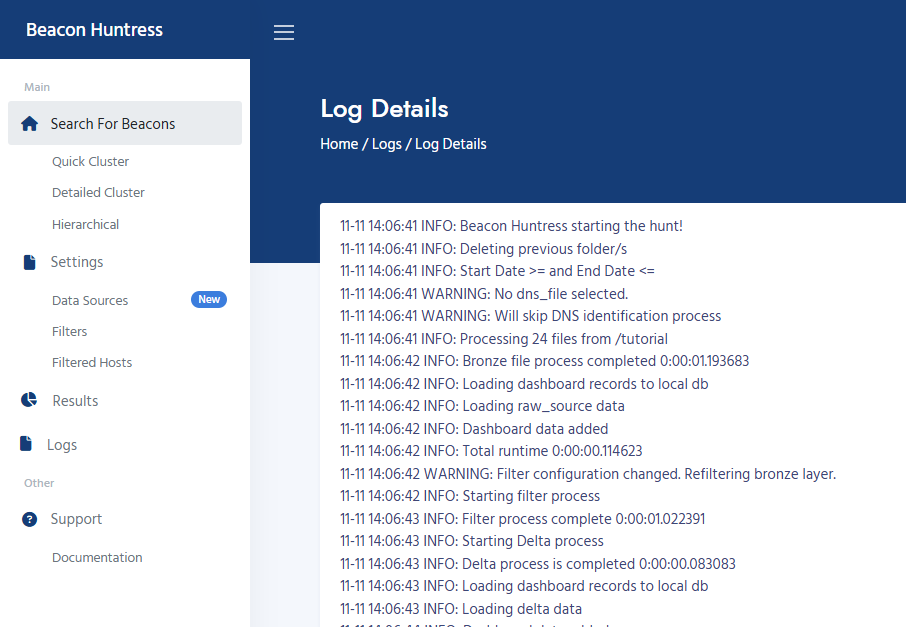

# Beacon Huntress User Interface

This page outlines the usage and functionalities of the Beacon Huntress UI.

## :material-application: **Execute**

The Execute tab has three sections: Quick Cluster Search, Cluster Search, and Hierarchical Search. For more information on Beacon Huntress algorithm configurations, see [Beacon Huntress Algorithms](../algorithms).

## **Settings**

## :material-file: **Data Sources**

The Data Sources section contains the data sources for Beacon Huntress. Reusable data sources are now available in Beacon Huntress. Current Data Source types are Zeek Connection Logs, Security Onion and Elastic.

???+ tip "Note"

    Beacon Huntress uses Zeek Connection Logs to find beacons. Elastic data sources must use Zeek Connection indices.

1. Navigate to the Settings tab and click on Data Sources.

2. Zeek Connection Logs is the default data source, and the source file location is entered at run time. To add a new data source, click the New button.

3. Select a Data Source Type from the drop-down list. Input fields will be dynamically generated based upon the chosen type.

### **Zeek Connection Logs**

Zeek Connection Logs are raw Zeek connection logs.

- The following inputs are required for Zeek Connection Logs:

  - **Data Source Name**

    - Unique name for your data source.

  - **Raw Log Location**

    - Raw Zeek file location.

### **Security Onion**

Security Onion data source will use Zeek connection logs contained inside of the application. The indices will be automatically selected. Click [API Key](#api) for more details.

- The following inputs are required for Security Onion:

  - **Data Source Name**
    - Unique name for your data source. 
  - **Host**
    - Security Onion Elastic Host Name. 
  - **Port**
    - Security Onion Elastic Port Name. 
  - **API Key**
    - Security Onion Elastic API Name. 
    - API Key can be viewed by clicking the eye button.

### **Elastic**

Elastic data source will use Zeek connection logs contained inside of the application. The indices will be automatically selected. Click [API Key](#api) for more details.

- The following inputs are required for Elastic:

  - **Data Source Name**
    - Unique name for your data source. 
  - **Host**
    - Elastic Host Name. 
  - **Port**
    - Elastic Port Name. 
  - **API Key**
    - Elastic API Name. 
      API Key can be viewed by clicking the eye button.
  - **Index**
    - Elastic Index Name (Multi-Select). 
      Click the button to load the indices. You must have the correct Host, Port and API Key in order to load the indices.

## :material-file: **Filters**

This section allows for the configuration of additional IP and port filtering. Filtering at this level will include/exclude certain results before the beacon algorithm runs.

1. Navigate to Settings and click on Filters.

2. The following parameters can be changed:

   - **Filter**
     - Checkbox to turn filter settings on or off.  
       Checked = Apply filters 
       Unchecked = Do not apply filters
   - **Port Filter**
     - A list of ports, in comma delimited format. 
   - **Port Filter Exclusive**
     - Checkbox to determine whether the ports in the Port Filter list are included or excluded from results. 
       Checked = Excluded 
       Unchecked = Included
   - **Source IP Filter**
     - A list of Source IPs, in comma delimited format. 
   - **Source IP Filter Exclusive**
     - Checkbox to determine whether the IPs in the Source IP Filter list are included or excluded from results. 
       Checked = Excluded 
       Unchecked = Included
   - **Destination IP Filter**
     - A list of Destination IPs, in comma delimited format. 
   - **Destination IP Filter Exclusive**
     - Checkbox to determine whether the IPs in the Destination IP Filter list are included or excluded from results. 
       Checked = Excluded 
       Unchecked = Included

### **Filtered Hosts**

The Filtered Hosts section will display any additional IP addresses that have been manually excluded from the beacon results. IPs that have been excluded from results using the Filters settings will not be displayed here. You can remove an IP address from this list by clicking on the "Trash Can" icon.
  

### **Default Filtered Hosts**

Default Filtered Hosts is a premade list of popular websites that are automatically filtered out from the results. These sites will not appear on the Filtered Hosts page. To see the complete list, go to the [Default Filtered Hosts](defaultfilteredhosts.md) page.

### **Results**

You can navigate through results found by Beacon Huntress using the options on the Results page. Click on "Group ID" to view potential beacons. Select "Dashboard" to display those results in a Grafana dashboard. Click on "Log File" to view the run logs. Choose "Config" to display the runtime configuration. Select "Delete" to <i><b>PERMANENTLY</b></i> remove the result set.

## **Logs**

The Logs section holds the runtime logs for each Beacon Huntress execution. Logs can also be accessed via the [Results page](#results).

1. Navigate to Logs.

2. Click on "File Name" to pull the details.

