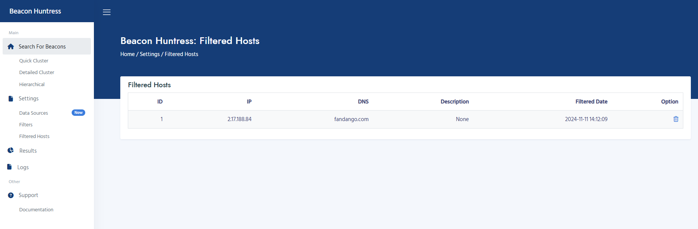
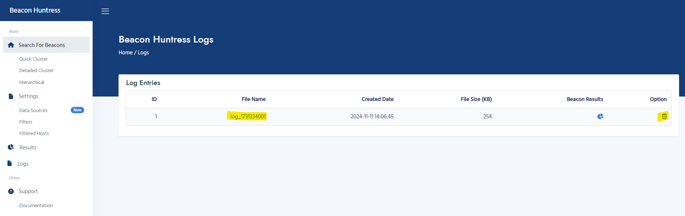
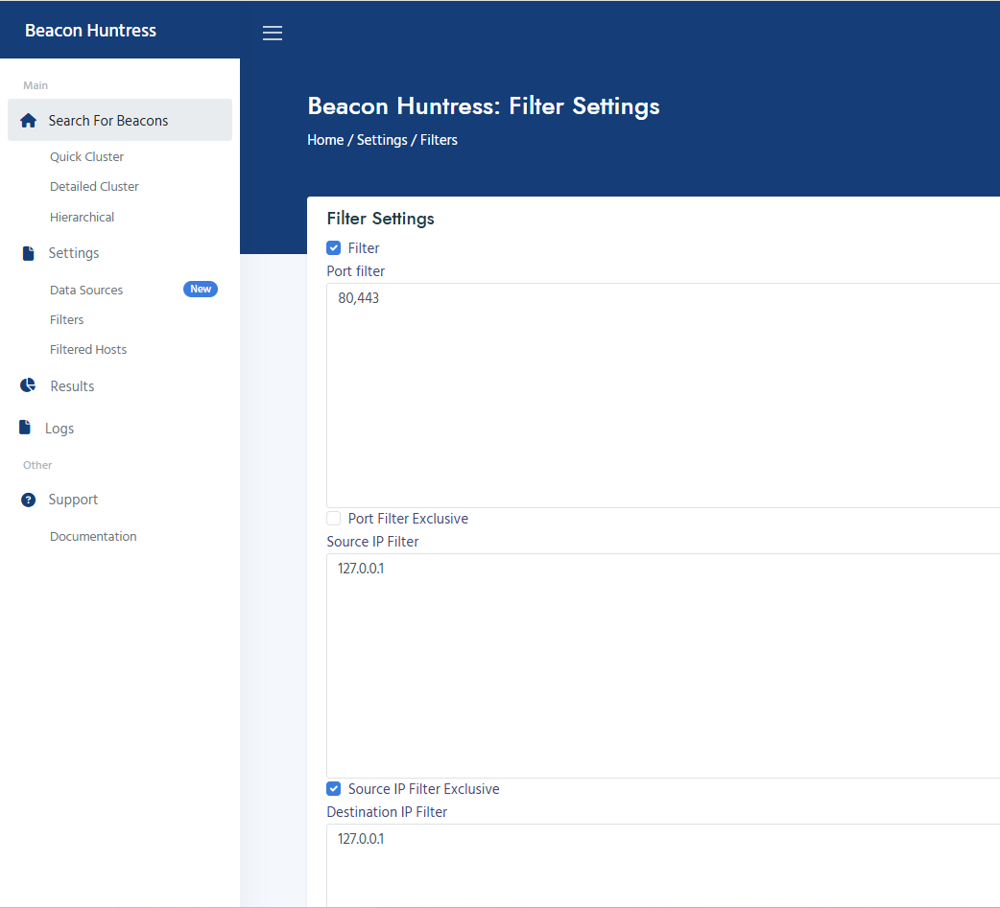

# Beacon Huntress Quick Start

Beacon Huntress uses a combination of Python and Machine Learning to find potential beacons.

## :material-clipboard: **Copy Zeek Logs**

Zeek Connection Logs are required to run Beacon Huntress. Follow the steps below to copy the Zeek Connection Logs. It's recommended to organize the logs into directories, with one directory per day.

1.  Zeek logs can be copied to the `/tmp` directory. The `/tmp` directory is mounted to the Docker container beacon_huntress.

         # CREATE DIRECTORY (REPLACE YYYY-MM-DD WITH DATE)
         mkdir -p /tmp/raw/data/YYYY-MM-DD

         # START SFTP SHELL
         sftp root@YOUR_SFTP_SERVER

         # SFTP COMMAND EXAMPLE (REPLACE YYYY-MM-DD WITH DATE)
         get -R /nsm/zeek/logs/YYYY-MM-DD/conn.* /tmp/raw/data/YYYY-MM-DD

## :material-web: **Open Web Page**

To get started

1.  Open a browser window
2.  Go to [127.0.0.1:8000](http://127.0.0.1:8000)
3.  You will now see Beacon Huntress loaded.

## **Configure**

How to configure Beacon Huntress to run a search.

1.  Navigate to Settings and click on General.

2.  You will have the following settings.

    - **Raw Log Location**
      - Physical location of the raw Zeek logs
    - **Working File Type**
      - The type of files you want to use. Parquet is the recommended setting
    - **Overwrite Existing Data**
      - Will overwrite all existing results
    - **Verbose Logging**
      - Verbose Logging True/False

## **Example Run**

This test run is using Quick Cluster Search with some test data.

1.  To run a test use the test dataset located in /tutorial. From the General Settings page change the Raw Log Location to /tutorial and click the save button.

2.  Navigate to Execute and select Quick Cluster Search.

1.  Quick Cluster Search expects the parameters below. In this example do not change anything, just click the run button. **_PLEASE NOTE: Do not exit this page, you will be directed to the results page once it is completed._**

    - **Average Delta Time**
      - Average delta time to include in the search using your delta column. Greater than equal (<=).
    - **Connection Count**
      - Total connection count for filtering. Greater than equal (>=).
    - **Time Span Average**
      - The percentage to increase and decrease from the connections total delta span.  
        EXAMPLE: 15 will decrease 15% from the minimum and maximum delta span.  
        min delta = 5  
        max delta = 10  
        span min = 4.25 (5 - (5 _15%))  
        span max = 11.5 (10 + (10_ 15%))
    - **Variance Percentage**
      - Total variance percentage for filtering. Greater than equal (>=).
    - **Minimum Likelihood Percentage**
      - Minimum likelihood value to identify a beacon.

2.  From the results you will have the following columns.

    - **Group ID**
      - This is your beacon search identifier. This will send you to a detail results screen..
    - **Date**
      - Date of beacon search.
    - **Beacon Count**
      - Number of potential beacons.
    - **Dashboard**
      - Link to a Grafana Dashboard.
    - **Log File**
      - The log file associated with this run. Used for troubleshooting.
    - **Config**
      - The configuration used for the beacon search.
    - **Delete**
      - Permanently delete the beacon search.

## **Result Details**

From the Result Details page you can further investigate or filter potential beacons. You will need to investigate these ips to determine if they are beacons. In this example both IPs are in fact beacons.

1.  Click on the Group ID.

1.  The result details page will display the following columns.

    - **ID**
      - Row identifier.
    - **Source IP**
      - Source IP Address.
    - **Destination IP**
      - Destination IP Address.
    - **Port**
      - Destination Port.
    - **Connection Count**
      - Number of connections for the source ip, destination ip and destination port.
    - **First Occurrence**
      - Date of first connection.
    - **Last Occurrence**
      - Date of latest connection.
    - **Filter**
      - Remove destination IP from future beacon results.

## **Filter Beacons**

You can filter out any falsely identified beacons from the Result Details page.

1.  To filter a destination ip click on the filter button. The destination ip will have be filtered from all beacon results. The ip will be excluded in any future results.

1.  To view or remove filtered beacons navigate to Settings, then Filtered Hosts. Click on the trash can to remove an IP from filtered host. Once remove the IP will show in beacon results.

    - **ID**
      - Row identifier.
    - **IP**
      - IP that is filtered from beacon results.
    - **Description**
      - Description of why the beacon was filtered. Please Note: This will be included in a future version.
    - **Filtered Date**
      - The date the IP was filtered.
    - **Option**
      - Delete the IP from the filtered beacons.

## **Dashboard**

You can access the Grafana Dashboard via the Dashboard button on the Result Details page.

???+ info "Note"
    For addtional details related to the Granfana Dashboard [go here](../dashboard).

The dashboard will open in another window.

## **Logs**

You can access the Logs via the Log button on the Result Details page. The log files are used for troubleshooting a beacon search.

All logs files are available via the Logs button on the navigation pane. You can open the log by clicking on the log file link. To delete log files permanently click on the trash can.

## **Run Configuration Details**

Beacon results configurations can be access via the Config link.

To find the algorithm used in the search, use the general.cluster type configuration. The cluster_type algorithm names are below.

> - dbscan_var = Quick Cluster Search
> - dbscan = Detailed Cluster Search
> - agg = Hierarchical

## **Quick Cluster Search**

Quick Cluster Search uses the same principals as Cluster Search but will exclude the amount of records that is needed to be scanned by variance and spans are generated based upon the percentage given. If the variance is outside of the configured threshold it is excluded from the scan. This feature provides all the benefits of a DBScan without the performance overhead.

1.  Navigate to Execute and select Quick Cluster Search.

1.  Quick Cluster Search expects the parameters below. In this example do not change anything, just click the run button. **_PLEASE NOTE: Do not exit this page, you will be directed to the results page once it is completed._**

    - **Average Delta Time**
      - Average delta time to include in the search using your delta column. Greater than equal (<=).
    - **Connection Count**
      - Total connection count for filtering. Greater than equal (>=).
    - **Time Span Average**
      - The percentage to increase and decrease from the connections total delta span.  
        EXAMPLE: 15 will decrease 15% from the minimum and maximum delta span.  
        min delta = 5  
        max delta = 10  
        span min = 4.25 (5 - (5 _15%))  
        span max = 11.5 (10 + (10_ 15%))
    - **Variance Percentage**
      - Total variance percentage for filtering. Greater than equal (>=).
    - **Minimum Likelihood Percentage**
      - Minimum likelihood value to identify a beacon.

## **Detailed Cluster Search**

Detailed Cluster Search uses DBScan to search for beacons. DBScan stands for Density-Based Spatial Clustering of Applications with Noise. DBScan discovers clusters of different sizes from a large amount of data that contains noise and outliers, see image below. DBScan primarily uses two parameter Minimum Points and ESP (Epsilion). Minimum points are the minimum number of points (a threshold) clustered together for a region to be considered dense. EPS is the distance measure that will be used to locate the points for a cluster.

1.  Navigate to Execute and select Cluster Search.

1.  Cluster Search expects the parameters below. **_PLEASE NOTE: Do not exit this page, you will be directed to the results page once it is completed._**

    - **Minimum Delta Time**

      - Minimum number of delta records to search using your delta column.

    - **Time Spans**

      - Spans you wish to search, in list format. Minimum number of delta records to search using your delta column.  
        EXAMPLE: Will search two spans 0-5 and 5-10.  
        \[\[0, 5\], \[5, 10\]\]

    - **Minimum Cluster Points**

      - Minimum number of points in the cluster.

    - **Likelihood Percentage**

      - Minimum likelihood value to identify a beacon.

## **Hierarchical Search**

Hierarchical Search uses Agglomerative clustering to find beacons. Agglomerative clustering is a Hierarchical clustering used to group objects in clusters based upon similarity. Each item is treated as a singleton cluster, working from the bottom up. Clusters that are similar are merged into a larger cluster. This process continues until all the clusters are placed into a single large cluster, see image below.

1.  Navigate to Execute and select Hierarchical Search.

1.  Hierarchical Search expects the parameters below. **_PLEASE NOTE: Do not exit this page, you will be directed to the results page once it is completed._**

    - **Maximum Variance Percentage**
      - Max Variance threshold for any potential beacons.
    - **Minimum Number of Values**
      - Minimum number of delta records to search.
    - **Cluster Factor Percentage**
      - The likelihood percentage for a cluster.
    - **Process Lines**
      - Line amounts to process at a time, in list format.
    - **Minimum Delta Time**
      - Minimum delta time to search by, in milliseconds.

## **Filter IPs**

Configuration for additional filtering. Filtering at this level will exclude/include prior to the beacon algorithm. Filtered beacons are post beacon algorithm.

1.  Navigate to Settings and click on Filters.

1.  Filter expects the parameters below. Change the parameter/s and click save.

    - **Filter**
      - Apply filters (True or False)
    - **Port Filter**
      - Port filterg in comma delimited format.  
        New line per port.
    - **Port Filter Exclusive**
      - Exclusive filter (True or False)  
        True = Exclusive  
        False = Inclusive
    - **Source IP Filter**
      - Source IP filtering in comma delimited format.  
        New line per port.<br
    - **Source IP Filter Exclusive**
      - Exclusive filter (True or False)  
        True = Exclusive  
        False = Inclusive
    - **Destination IP Filter**
      - Destination IP filtering in comma delimited format.  
        New line per port.<br
    - **Destination IP Filter Exclusive**
      - Exclusive filter (True or False)  
        True = Exclusive  
        False = Inclusive

