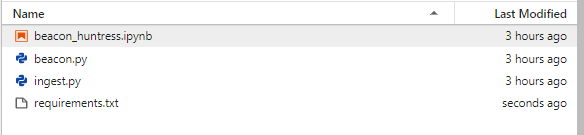

# Run Options

Below are the available options that can used. Click on the links below for the details.<br>
For example beacon search settings go to [Search for Beacons](#searchforbeacons).

* [Command Line Interface (CLI)](#cli)
* [Docker](#docker)
* [Juypter Notebook](#jupyter)

## <a name="cli"></a>__Command Line Interface (CLI)__

CLI can currently only be run without a dashboard. Please use Docker to run Beacon Huntress with a dashboard.<br>
Proceed with the following steps in the terminal:

1. `cd src` to the src directory.
2. Run `sudo python3 -m venv bh` to setup the Python Virtual Environment.
3. Run `source bh/bin/activate` to activate the Python Virtual Environment.
4. Run `sudo pip3 install -r setup/requirements.txt` to import the requirments file.
5. Change the default configuration file (`src/config/config.conf`) settings below.
    * You must set `dashboard` in [config.conf](configuration.md) to `false`.
6. Run `python3 beacon_huntress.py` to check for beacons.

### __CLI Run w/Example Results__
```shell
(bh) python3 beacon_huntress.py
 ____                                     _   _                _
| __ )   ___   __ _   ___   ___   _ __   | | | | _   _  _ __  | |_  _ __   ___  ___  ___ 
|  _ \  / _ \ / _` | / __| / _ \ | '_ \  | |_| || | | || '_ \ | __|| '__| / _ \/ __|/ __|
| |_) ||  __/| (_| || (__ | (_) || | | | |  _  || |_| || | | || |_ | |   |  __/\__ \\__ \
|____/  \___| \__,_| \___| \___/ |_| |_| |_| |_| \__,_||_| |_| \__||_|    \___||___/|___/

Beacon Huntress starting the hunt!
        * Building Bronze Layer |################################| 5/5 file/s | 0:00:14
        * Filter Process |################################| 5/5 file/s | 0:00:03
        * Building Delta File |################################| 5/5 steps/s | 0:00:04
        * Searching for Beacons (DBScan by Variance) |################################| 1/1 connections | 0:00:00
XXXXXXXXXXXXXXXXXXXXXXXXXXXXXXXXXXXXXXXXXXXXXXXXXX  POTENTIAL BEACONS (1) XXXXXXXXXXXXXXXXXXXXXXXXXXXXXXXXXXXXXXXXXXXXXXXXXX
       source_ip       dest_ip  port  connection_count  avg_delta
0  127.0.0.1      127.0.0.1    80                15      20
XXXXXXXXXXXXXXXXXXXXXXXXXXXXXXXXXXXXXXXXXXXXXXXXXXXXXXXXXXXXXXXXXXXXXXXXXXXXXXXXXXXXXXXXXXXXXXXXXXXXXXXXXXXXXXXXXXXXXXXXX
```

## <a name="docker"></a>__Docker__

Docker is the preferred way to run Beacon Huntress with a dashboard.<br>

1. Docker is installed and running (try `docker --version` in the terminal)
2. Docker-compose is installed (try `docker-compose --version` in the terminal)

Good to go? OK, proceed with the following in the terminal:

1. `cd` to this directory
2. `docker-compose up -d` this may take some time on first run while the database is created
3. Note that some docker volumes were created, 
   - `_beacon_huntress` maps to where we will put Zeek logs for processing
   - `_mysql` is your database, so that if the container stops, you do not lose previously saved data
4. Place your Bro/Zeek logs in `_beacon_huntress` for processing.
5. Check `docker logs -f beacon_huntress` for access to logging

## <a name="jupyter"></a>__Jupyter Notebook__

Complete the steps below setup Beacon Huntress on Jupyter.

???+ tip "Note"
    Beacon Huntress has python dependancies that are required for operation.  __Do not skip steps 5 & 6 from the setup!__

### <a name="setup"></a>__Juptyer Notebook Setup__
1) Create a folder in Jupyter called `beacon_huntress`.<br>
2) Copy the `/src/lib/jupyter/beacon_huntress.ipynb` file from this repository into the beacon_huntress folder in Jupyter.<br>
3) Copy the `/src/bin/beacon/beacon.py` folder from this repository into Jupyter.<br>
4) Copy the `/src/bin/ingest.py` folder from this repository into Jupyter.<br>
5) Copy the `/src/lib/jupyter/requirements.txt` file into the beacon_huntress folder in Jupyter.<br>
6) Open a Jupyter terminal session and execute the code below to install the requirements.txt into a Jupyter kernel called beacon_huntress.<br>

```shell
# CREATE VIRTUAL ENV
python3 -m venv beacon_huntress

# ACTIVATE VIRTUAL ENV
source $HOME/beacon_huntress/bin/activate

# INSTALL REQUIREMENTS FILE
pip3 install -r beacon_huntress/requirements.txt

# LOAD KERNEL TO JUPYTER
sudo ipython kernel install --name "beacon_huntress"
```

After everything is installed you should see this structure.



After completing the [Setup](#setup) above Beacon Huntress should now be available to run within Jupyter.<br>

Open beacon_huntress.ipynb inside a Jupyter notebook.  Run the steps below.

1) Run the `BUILD BRONZE DATA LAYER` shell.  Minimum parameters are below for the full list go to link.
    * __src_loc__ <i>(string) </i><br>
    Raw Bro/Zeek logs folder.
    * __bronze_loc__ <i>(string)</i><br>
    Bronze folder location.  Folder where data will compressed and converted to parquet format.

    ```python
    import ingest

    # BUILD BRONZE DATA LAYER
    ingest.build_bronze_layer(
        src_loc="data/raw/data", 
        bronze_loc="data/bronze/zeek/raw/parquet/mc3"
        )
    ```    

2) Run the `CREATE FILTERED FILES` shell if you wish you filter files.  Minimum parameters are below for the full list go to link.
    * __src_loc__ <i>(string)</i><br>
    Raw Bro/Zeek logs folder.
    * __dest_exclude_file__ <i>(string)</i><br>
    Destination folder location for non-matching filters.  __Excluding matches__.<br>
    Use a unique folder name at the end to identify your filter, a data folder will appended automatically.<br>
    Pass a blank double quote ("") to skip the creation of an exclude file.<br>
    * __port_filter__ <i>(list)</i><br>
    Ports you want to filter by in a list format.  __Inclusive results only__.<br>

    ```python
    # CREATE FILTERED FILES
    # SEE README.MD FOR ADDITIONAL OPTIONS
    ingest.build_filter_files(
    src_loc = "data/bronze/zeek/raw/parquet/mc3",
    dest_exclude_file = "data/bronze/zeek/filtered/parquet",
    port_filter = [80, 443]
    )
    ```    

3) Run the `BUILD DELTA FILES` shell to build the delta files.  Minimum parameters are below for the full list go to link.
    * __src_file__ <i>(string)</i><br>
    Source folder or file location.<br>
    * __delta_file_loc__ <i>(string)</i><br>
    Destination folder or file location for delta files.<br>

    ```python
    # BUILD DELTA FILES
    ingest.build_delta_files(src_loc = "data/bronze/zeek/filtered/parquet",
                         delta_file_loc = "data/silver/delta")
    ```

4) Choose the algorithm you want to run, and configure the settings.  You could also run all algorithms.
    * [Agglomerative Clustering](configuration.md#a-idagglomerativeclusteringaagglomerative-clustering)
        * __delta_file__ <i>(string)</i><br>
        Source delta file.<br>
        * __delta_column__ <i>(string)</i><br>
        Source delta column. Options below, ms = milliseconds and mins = minutes<br>
            * delta_ms
            * delta_mins
        * __max_variance__ <i>(float)</i><br>
        Variance threshold for any potential beacons.<br>
        * __min_records__ <i>(int)</i><br>
        Minimum number of delta records to search.<br>
        * __cluster_factor__ <i>(float)</i><br>
        The likelihood percentage for a cluster.<br>
        * __line_amounts__ <i>(list)</i><br>
        Line amounts to process at a time, in list format.<br>
        * __min_delta_time__ <i>(string)</i><br>
        Minimum delta time to search by, in milliseconds.

        ```python
        import beacon

        # AGGLOMERATIVE CLUSTERING
        # SLOW BEACON
        beacon.agglomerative_clustering(
            delta_file = "data/silver/delta/delta_1655318432.parquet",
            delta_column = "delta_mins",
            max_variance = .12,
            min_records = 10,
            cluster_factor = .70,
            line_amounts = [1],
            min_delta_time = 1200000
        )
        ```
    
    * [DBScan Clustering](configuration.md#a-iddbscanclusteringadbscan-clustering)
        * __delta_file__ <i>(string)</i><br>
        Source delta file.<br>
        * __delta_column__ <i>(string)</i><br>
        Source delta column. Options below, ms = milliseconds and mins = minutes<br>
            * delta_ms
            * delta_mins    
        * __minimum_delta__ <i>(int)</i><br>
        Minimum number of delta records to search using your delta column.<br>
        * __spans__ <i>(list)</i> <br>
        Spans you wish to search, in list format. Minimum number of delta records to search using your delta column.<br>
        <i>EXAMPLE: Will search two spans 0-5 and 5-10.<br>
        [[0, 5], [5, 10]]</i><br>
        * __minimum_points_in_cluster__ <i>(int)</i><br>
        Destination file type (csv or parquet).<br>
        * __minimum_likelihood__ <i>(float)</i> <br>
        Minimum likelihood value to identify a beacon.

        ```python
        import beacon

        # DBSCAN
        # SLOW BEACON
        beacon.dbscan_clustering(
            delta_file = "data/silver/delta/delta_1655318432.parquet",,
            delta_column = "delta_mins",
            spans = [[0, 5], [2, 15], [15, 35], [30, 60]],
            minimum_delta = 20,
            minimum_points_in_cluster = 10,
            minimum_likelihood = 0.70
        )
        ```

    * [DBScan by Variance](configuration.md#a-iddbscanbyvarianceadbscan-by-variance-clustering)
        * __delta_file__ <i>(string)</i><br>
        Source delta file.<br>
        * __delta_column__ <i>(string)</i><br>
        Source delta column. Options below, ms = milliseconds and mins = minutes<br>
            * delta_ms
            * delta_mins    
        * __avg_delta__ <i>(int)</i><br>
        Average delta time to include in the search using your delta column. Greater than equal (>=).<br>
        * __conn_cnt__ <i>(int)</i><br>
        Total connection count for filtering. Greater than equal (>=).<br>
        * __span_avg__ <i>(int)</i><br>
        The percentage to increase and decrease from the connections total delta span.<br>
        <i>EXAMPLE: 15 will decrease 15% from the minimum and maximum delta span.<br>
            <t>min delta = 5<br>
            <t>max delta = 10<br>
            <t>span min = 4.25 (5 - (5 * 15%))<br>
            <t>span max = 11.5 (10 + (10 * 15%))</i><br>
        * __variance_per__ <i>(int)</i><br>
        Total variance perctage for filtering. Greater than equal (>=).<br>
        * __minimum_likelihood__ <i>(int)</i><br>
        Minimum likelihood value to identify a beacon.<br>

        ```python
        import beacon

        # DBSCAN by VARIANCE
        # SLOW BEACON
        beacon.dbscan_by_variance(
            delta_file = "data/silver/delta/delta_1655318432.parquet",
            delta_column = "delta_mins",
            avg_delta = 20,
            conn_cnt = 10,
            span_avg = 15,
            variance_per = 15,
            minimum_likelihood = 70
        )
        ```
