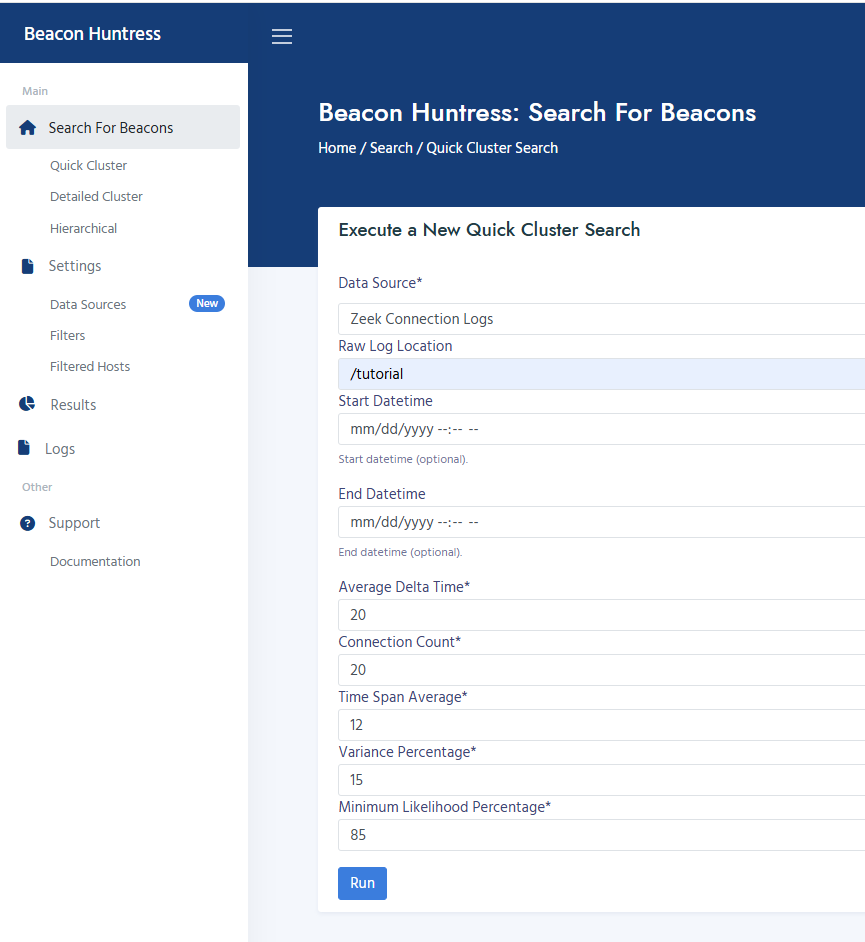
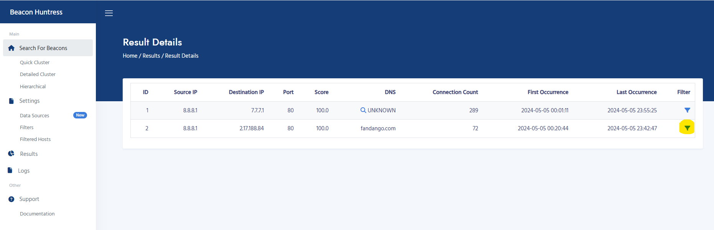
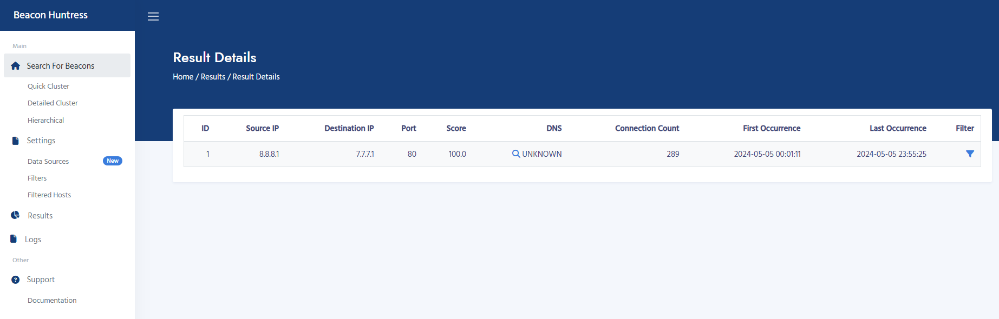

# Beacon Huntress Tutorial

This tutorial will provide an example for running Beacon Huntress using a generic dataset.

???+ tip "Note"

    You must complete the [Docker Setup](#docker) prior to running this tutorial.

1. Visit [http://127.0.0.1:8000](http://127.0.0.1:8000) in your web browser to access the main page of the Beacon Huntress Web UI.

   

2. Go to the "Search For Beacons" tab and select "Quick Cluster".

3. Change the "Data Source" to "Zeek Connection Logs" and set the "Raw Log Location" to `/tutorial`. Click "Run" to perform a beacon search. The execution will take a moment.

   

4. After the execution is finished, you'll be redirected to the results page. For this dataset, the "Beacon Count" column shows that two potential beacons have been identified. Several options are now available. Click on "Group ID" to view the potential beacons. Click the "Dashboard" icon to display results in a Grafana dashboard. Click on the "Log File" icon to view the run logs. Click the "Config" icon to display runtime configuration. Click the "Delete" icon to <i><b>PERMANENTLY</b></i> remove this result set.

   

5. Click "Group ID" to view potential beacons. In this example, Beacon Huntress has identified two potential beacons: 7.7.7.1 and 2.17.188.84 ("fandango.com"). The 7.7.7.1 connection is our target test beacon, but the connections to "fandango.com" are benign traffic. Since the identification of "fandango.com" as a beacon is incorrect, we will exclude this result from the current and future runs by clicking the "Filter" icon.

   

6. Now, the results from "fandango.com" are filtered out.

   

7. To view all of your filtered hosts, go to the "Settings" tab and select "Filtered Hosts". Filtered hosts can be removed from this list by clicking the "Trash Can" icon in the "Option" column, which will cause them to once again appear in the results.

   

8. Go back to the "Results" tab and click on the "Dashboard" icon.

   

9. A Grafana dashboard will open in a new browser tab. See [Dashboard]() for more details on dashboard usage and functionality.

   

### Congratulations! You have completed your first Beacon Huntress test run!

## <a name="zeek"></a>**Zeek Logs**

Zeek Connection Logs must be provided for Beacon Huntress to analyze. Follow the steps below to copy your Zeek logs from their initial location to a local directory that can be accessed by Beacon Huntress. It's recommended that you organize the logs into separate directories, with each directory corresponding to a single day.

1. In this example, we will copy Zeek connection logs to the `/zeek` directory. The `/zeek` directory is mounted to the Docker container beacon_huntress.

   ```bash
   # CREATE DIRECTORY (REPLACE YYYY-MM-DD WITH DATE)
   mkdir -p /zeek/raw/data/YYYY-MM-DD

   # START SFTP SHELL
   sftp root@YOUR_FTP_SERVER

   # SFTP COMMAND EXAMPLE (REPLACE YYYY-MM-DD WITH DATE)
   get -R zeek/logs/YYYY-MM-DD/conn.* /zeek/raw/data/YYYY-MM-DD
   ```

2. When you run a beacon search, select "Zeek Connection Logs" as a "Data Source" and then change the "Raw Log Location" to `/zeek`. This will run the search on the Zeek connection logs.

   
