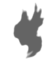
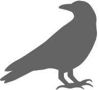

# Valkyrie Framework

Developed by [Carnegie Mellon University's Software Engineering Institute (SEI)](https://sei.cmu.edu), the **Valkyrie Framework** is an open source suite of tools that enable hunt teams to locate and identify hidden cybersecurity threats lurking in network traffic using machine learning and other advanced analytics.

???+ tip "About the Framework"
    There are two tools in the Framework currently, but we expect more in the future.

    The [Source Code Repository](https://github.com/cmu-sei/Valkyrie_Framework) is hosted on GitHub.

## {: .bh-inline } [Beacon Huntress](beacon_huntress)

Beacon Huntress is designed to identify malicious network beacons. But first, what are network beacon? We define network beacons as events that occur (and re-occur) on a timed interval. Network beacons can be compared to a heartbeat signal over time. While there are legitimate uses for network beacons (e.g., WiFi, obtaining instructions from an API, beaming telemetry data home), network beaconing can also be a byproduct of malware connecting to a command and control (C2) server. Malware communicating with a C2 server can pass information or request new instructions.

Beacons can be difficult to spot with traditional security tools -- especially those that communicate infrequently. Beacon Huntress finds beacons within Zeek logs using machine learning algorithms that identify clustering.

Beacon Huntress uses a combination of Python and Machine Learning to find potential beacons.

## {: .ipmaven-inline } [IP Maven](ip_maven)

IP Maven is a DNS service that provides detailed information about IP addresses and their associated netblock records, both online and offline.

The thinking is that by combining normal zeek dns logs with the netblock information, we can provide a more detailed view of the network traffic.

## :material-bug: Reporting Bugs

Found a bug? Please report it through the [issue tracker](https://github.com/cmu-sei/valkyrie_framework/issues). Include detailed steps for reproducing the issue and any relevant error messages.

## :material-new-box: Requesting Features

Have a feature request? Submit new ideas through the [issue tracker](https://github.com/cmu-sei/valkyrie_framework/issues) with a description of how it could benefit the community.

## :material-license: License

[DISTRIBUTION STATEMENT A] This material has been approved for public release and unlimited distribution.  
Copyright 2023 Carnegie Mellon University. See the [license file](https://github.com/cmu-sei/valkyrie_framework/blob/master/license.txt) for more details.
