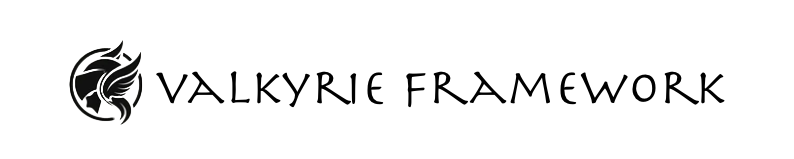

# Valkyrie Framework

Valkyrie Framework is an open source suite of tools that enable hunt teams to locate and identify hidden cybersecurity threats lurking in network traffic.

## Key Links

- **[Valkyrie Framework Documentation](https://cmu-sei.github.io/Valkyrie_Framework)**
- [Submit issues and feature requests](https://github.com/cmu-sei/Valkyrie_Framework/issues)

## There are two main components to the Valkyrie Framework:

### Beacon Huntress

Beacon Huntress is designed to identify malicious network beacons. But first, what are network beacon? We define network beacons as events that occur (and re-occur) on a timed interval. Network beacons can be compared to a heartbeat signal over time. While there are legitimate uses for network beacons (e.g., WiFi, obtaining instructions from an API, beaming telemetry data home), network beaconing can also be a byproduct of malware connecting to a command and control (C2) server. Malware communicating with a C2 server can pass information or request new instructions.

Beacons can be difficult to spot with traditional security tools -- especially those that communicate infrequently. Beacon Huntress finds beacons within Zeek logs using machine learning algorithms that identify clustering.

Beacon Huntress uses a combination of Python and Machine Learning to find potential beacons.

**For more details see the Beacon Huntress [read me](https://github.com/cmu-sei/Valkyrie_Framework/tree/main/beacon_huntress) file.**

### IP Maven

IP Maven is a DNS service that provides detailed information about IP addresses and their associated netblock records, both online and offline.

The thinking is that by combining normal zeek dns logs with the netblock information, we can provide a more detailed view of the network traffic.

**For more details see the IP Maven [read me](https://github.com/cmu-sei/Valkyrie_Framework/tree/main/ip_maven) file.**

---

## License

**Copyright 2023 Carnegie Mellon University.**

NO WARRANTY. THIS CARNEGIE MELLON UNIVERSITY AND SOFTWARE ENGINEERING INSTITUTE MATERIAL IS FURNISHED ON AN "AS-IS" BASIS. CARNEGIE MELLON UNIVERSITY MAKES NO WARRANTIES OF ANY KIND, EITHER EXPRESSED OR IMPLIED, AS TO ANY MATTER INCLUDING, BUT NOT LIMITED TO, WARRANTY OF FITNESS FOR PURPOSE OR MERCHANTABILITY, EXCLUSIVITY, OR RESULTS OBTAINED FROM USE OF THE MATERIAL. CARNEGIE MELLON UNIVERSITY DOES NOT MAKE ANY WARRANTY OF ANY KIND WITH RESPECT TO FREEDOM FROM PATENT, TRADEMARK, OR COPYRIGHT INFRINGEMENT.

Released under a MIT (SEI)-style license, please see license.txt or contact permission@sei.cmu.edu for full terms.
[DISTRIBUTION STATEMENT A] This material has been approved for public release and unlimited distribution.  Please see Copyright notice for non-US Government use and distribution.

Carnegie Mellon® and CERT® are registered in the U.S. Patent and Trademark Office by Carnegie Mellon University.

DM23-0210
